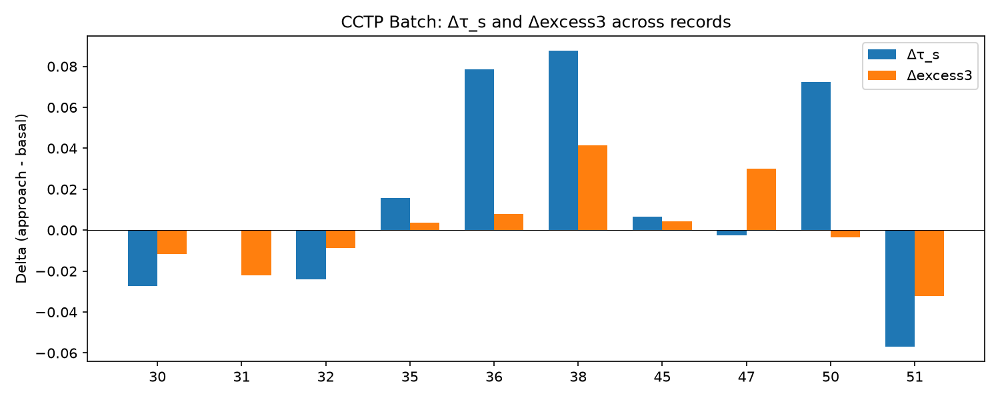
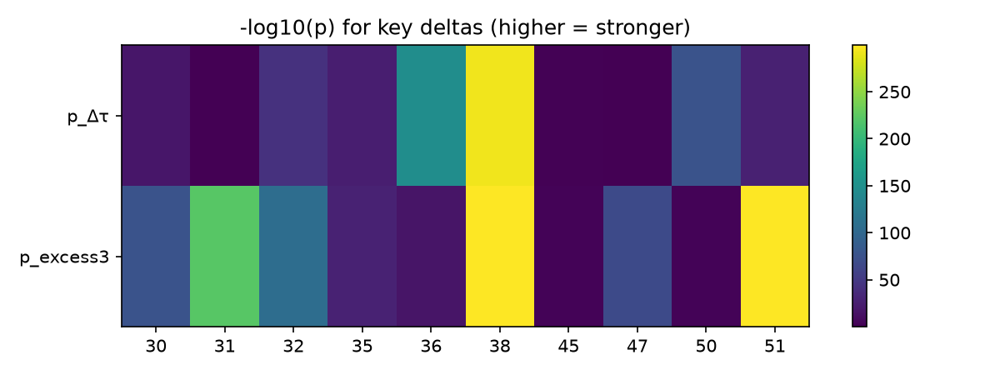
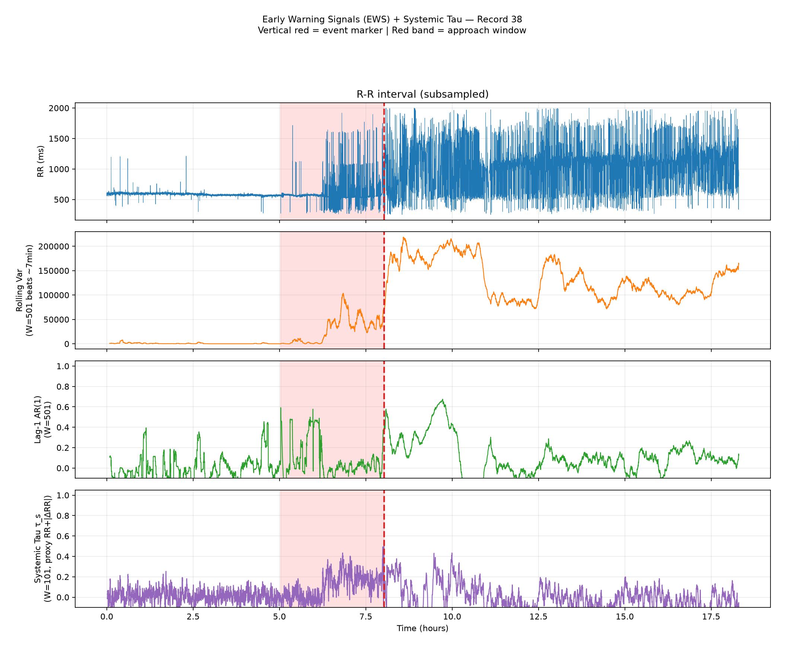
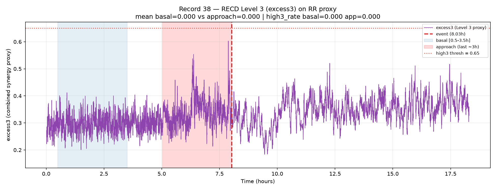
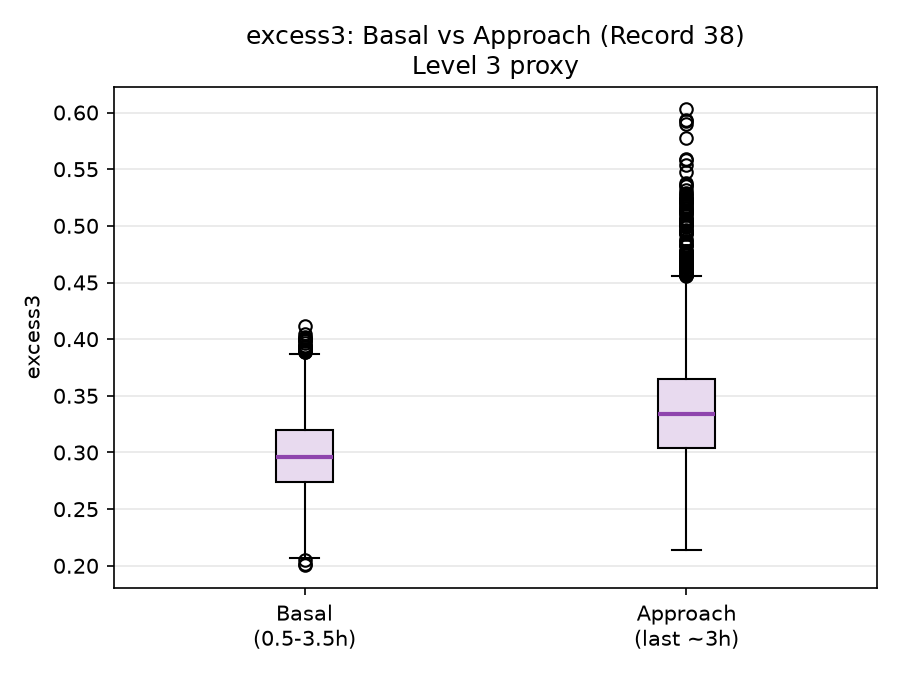
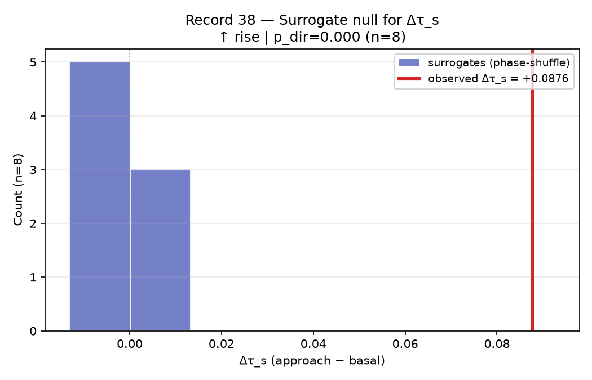
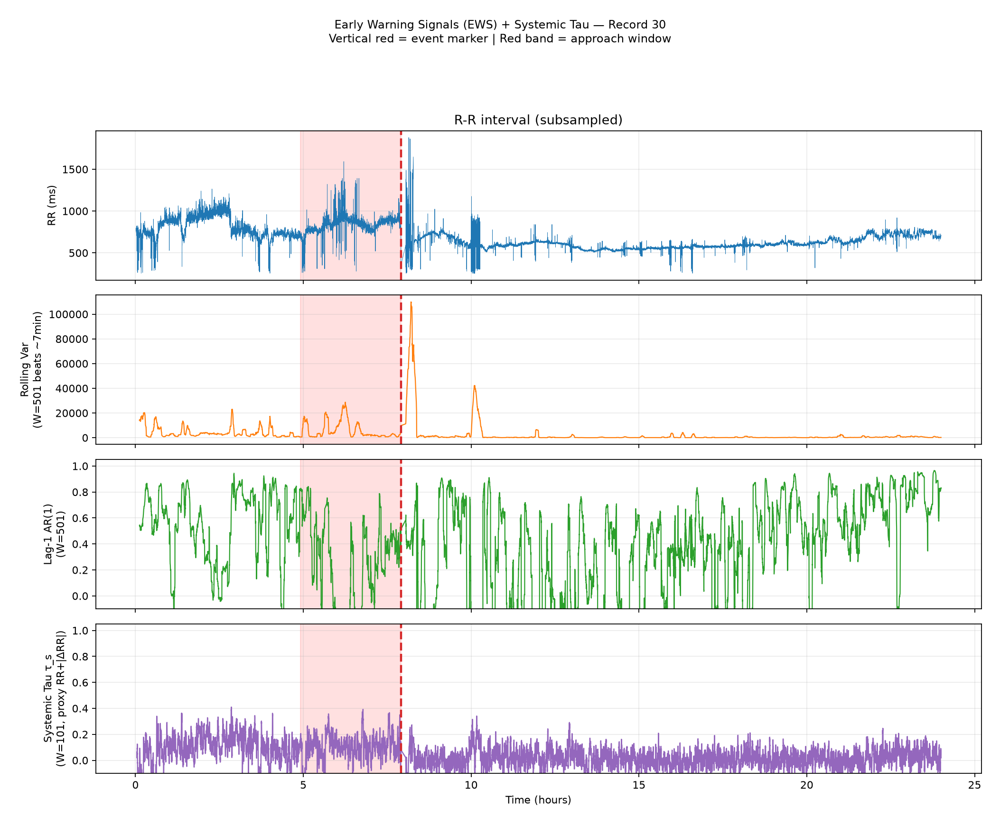
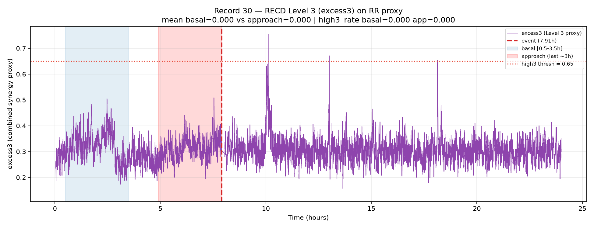
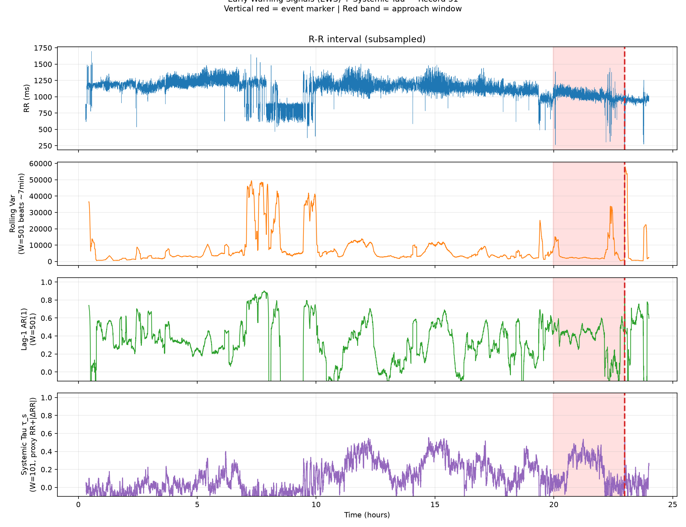
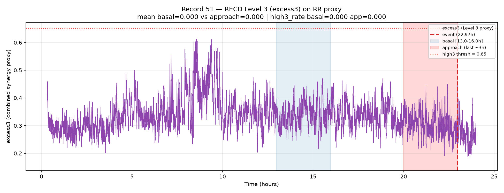

# Abstract

Sudden cardiac death from ventricular fibrillation (VF) remains difficult to anticipate from surface electrocardiography. Classic early-warning signals (EWS) such as rising variance or lag-1 autocorrelation often fail or reverse in real cardiac data because they assume a simple critical-slowing-down scenario. We introduce a relational, multivariate analysis pipeline that combines (i) \textbf{Systemic Tau} ($\tau_s$), an ordinal, Kendall-based measure of cross-variable coupling change, with (ii) \textbf{ordinal recurrence quantification} under the Discrete Extramental Clock (RECD) framework, which decomposes a bivariate heart-rate proxy into hierarchical symbolic levels ($\Phi_1$, $\Phi_2$, $\Phi_3$) and tracks the continuous excess contribution of the highest level (excess3).

Applied to $N=10$ high-quality records from the PhysioNet Sudden Cardiac Death Holter Database (SDDB; 23 records total), we find that $\Delta\tau_s$ and $\Delta\mathrm{excess3}$ are statistically extreme under phase-shuffle surrogates in the majority of cases and, crucially, maintain \textbf{sign concordance} (8/10 records) even when the direction is opposite to classical variance increase. Intermittent pacing and atrial fibrillation cases were retained after explicit quality flagging and did not abolish the signal. Two records with small effect sizes (47 and 50) showed discordant direction and are interpreted as borderline transitions. Light re-calibration of synthetic-derived thresholds ($\theta_3=0.08$, high-threshold $=0.65$, relative $\lambda$) is documented; the continuous excess3 metric remains primary.

These results support a view of pre-VF transitions as \emph{context-dependent reorganizations of the relational structure of heart-rate dynamics}, rather than as a uniform loss of stability. The findings provide real-world physiological support for the Systemic Tau and RECD framework as tools capable of detecting relational reorganizations that precede critical transitions in noisy biological signals where classical univariate EWS fail or reverse. The pipeline is fully reproducible (\url{https://github.com/johelpadilla/cctp-sddb-systemic-tau}) and immediately extensible to other Holter collections.

\vspace{0.4em}
\noindent\textbf{Keywords:} Systemic Tau; Discrete Extramental Clock (RECD); ordinal patterns; early-warning signals; ventricular fibrillation; heart-rate variability; network physiology; PhysioNet SDDB; critical transitions; surrogate testing.

\vspace{0.5em}
\noindent\rule{\textwidth}{0.4pt}

# 1. Introduction

## 1.1 Clinical and scientific motivation

Sudden cardiac death (SCD) is a leading cause of mortality worldwide, and ventricular fibrillation (VF) is among its principal terminal rhythms. Despite decades of progress in implantable devices, risk stratification, and Holter analysis, anticipating spontaneous VF from continuous surface ECG remains an open problem in both clinical cardiology and complex-systems physiology [@Goldberger2000; @Ivanov1999; @Bashan2012].

Classical approaches emphasize univariate heart-rate variability (HRV) descriptors---variance, lag-1 autocorrelation, fractal scaling, multifractality---and, more recently, machine-learning classifiers trained on pre-VF segments from public databases such as the Sudden Cardiac Death Holter Database (SDDB) [@Greenwald1986; @PhysioNetSDDB; @Velazquez2021; @Heng2020]. These tools are valuable, yet they often inherit an implicit dynamical assumption: that the approach to VF resembles a generic critical transition marked by critical slowing down (CSD), with rising variance and rising autocorrelation [@Scheffer2009; @Scheffer2012; @Dakos2012].

Empirical cardiac dynamics frequently violate that assumption. Variance may rise while lag-1 autocorrelation falls; atrial fibrillation (AF) and intermittent pacing can dominate the signal; annotation quality varies; and the same numerical "early warning" can point in opposite directions depending on the clinical substrate. What is needed is a language that tracks \emph{relational reorganization}---how the coupling among dynamical degrees of freedom changes---rather than only the amplitude of fluctuations in a single series.

## 1.2 Systemic Tau

Systemic Tau ($\tau_s$) is an ordinal, multivariate stability metric developed for noisy, non-stationary complex systems [@Padilla2025preprints; @Padilla2026synthesis; @Padilla2026software; @Padilla2025chaotic]. At its core it uses rank-based (Kendall-type) association structure across simultaneous series, computed in sliding windows, to quantify how \emph{relational coherence} evolves in time.

Let $X(t)=(X^{(1)}_t,\ldots,X^{(d)}_t)$ be a $d$-variate series (here $d=2$). In each sliding window of length $W_{\tau}$, Systemic Tau aggregates ordinal concordance among coordinates into a scalar $\tau_s(t)\in[-1,1]$ that rises when mutual rank organization tightens and falls when it loosens. The basal-to-approach contrast

$$
\Delta\tau_s=\overline{\tau_s}^{(\mathrm{approach})}-\overline{\tau_s}^{(\mathrm{basal})}
$$

is therefore a directed measure of relational reorganization, not a univariate fluctuation score. Three properties make $\tau_s$ attractive for Holter RR analysis:

1. **Ordinal robustness.** Because ranks replace raw amplitudes, $\tau_s$ is comparatively robust to monotone rescaling and to moderate outliers---a practical advantage on interpolated RR series.
2. **Multivariate by construction.** Systemic Tau is not a univariate complexity score; it measures change in \emph{cross-variable} organization. In this study the bivariate proxy is $X(t)=\big[z(\mathrm{RR}),\,z(|\Delta\mathrm{RR}|)\big]$, pairing level and successive irregularity.
3. **Early-warning orientation.** Large or systematic shifts in $\tau_s$ are interpreted as candidate signals of structural reorganization, not necessarily as ``approaching collapse'' in the classical CSD sense. The \emph{sign} of $\Delta\tau_s$ carries information about the \emph{direction} of the reorganization (e.g., tightening vs loosening of relational structure).

Readers familiar only with variance-based EWS may think of $\tau_s$ as answering a different question: not ``Is the system fluctuating more?'' but ``Is the \emph{pattern of mutual organization} among variables changing as the event approaches?''

## 1.3 Nested ordinal mathematics of the Discrete Extramental Clock (RECD)

The Discrete Extramental Clock (RECD) extends Systemic Tau by asking a complementary mathematical question: \emph{when} and \emph{at what depth} do multivariate ordinal events cohere strongly enough to advance a discrete, system-generated time index [@Padilla2026software; @Padilla2026ontological; @Padilla2026synthesis]. The framework builds hierarchical \textbf{ordinal conjunctions} from Bandt--Pompe symbolic dynamics [@BandtPompe2002]. On the same series $X(t)$, each coordinate is encoded by short ordinal patterns of embedding dimension $m$ and delay $\tau$ (here $m=3$, $\tau=1$). Write $\pi^{(i)}_t$ for the ordinal pattern of coordinate $i$ at time $t$. Conjunctions are not a single flat rule; they form a nested hierarchy---each deeper level contains and transcends the previous---with mathematics matched to the depth of structure:

**Level 1 --- coincidence ($\Phi_1$).** The weakest conjunction is simultaneous equality (or co-occurrence) of ordinal symbols across coordinates. With indicator $\mathbf{1}\{\cdot\}$,

$$
\Phi_1(t)=\sum_{i<j}\mathbf{1}\big\{\pi^{(i)}_t=\pi^{(j)}_t\big\}
$$

(or an equivalent windowed frequency of shared symbols). Level 1 is ordinal synchronization: pure counting statistics, mutual-information-like, and easy to validate, but insufficient alone to mark a nontrivial advance of discrete system time.

**Level 2 --- persistent relational structure ($\Phi_2$).** Level 2 does not require identical symbols; it requires a \emph{relation} $R$ among patterns that persists for at least $p_{\min}$ consecutive steps (lead/lag, opposition, fixed joint transition, meta-ordinal configuration). Schematically,

$$
\Phi_2(t)=\sum_{i<j} w(R)\,
\mathbf{1}\Big\{\,R\big(\pi^{(i)}_{t-k},\pi^{(j)}_{t-k}\big)
\text{ holds for all }k=0,\ldots,p_{\min}-1\,\Big\},
$$

where $w(R)$ weights relation type or strength. Graphically, Level 2 lives on a pattern graph or an ordinal Markov chain: nodes are patterns, edges encode durable cross-variable organization. The clock now advances not by volume of coincidences but by quality and memory of relational structure.

**Level 3 --- irreducible surplus / emergence ($\Phi_3$, excess3).** Level 3 isolates configurations whose joint ordinal organization is not explained by Levels 1--2 alone. Writing $I_{\mathrm{syn}}$ for a synergistic (or integrated) information surplus of the joint pattern set relative to pairwise relational structure,

$$
\Phi_3(t)=\mathbf{1}\big\{\,I_{\mathrm{syn}}\big(\{\pi^{(i)}_t\}_{i\in S}\big)>\theta_3\,\big\},
$$

with continuous companion

$$
\mathrm{excess3}(t)=
\big[I_{\mathrm{syn}}\big(\{\pi^{(i)}_t\}\big)
-I_{\mathrm{rel}}^{(2)}(t)\big]_+\,.
$$

Here $[\cdot]_+$ denotes the positive part and $I_{\mathrm{rel}}^{(2)}$ summarizes Level-2 relational information. Operationally, excess3 is the continuous surplus contribution of the highest nested layer beyond lower-order expectations---the practical Level-3 readout used throughout this study. A binary high-level rate (fraction of windows with excess3 above a threshold) is retained for extensibility but is secondary on noisy Holter data (Section 3.3).

**Nested advance of the RECD.** The three contributions combine as a depth-dependent update of the discrete clock,

$$
\Delta\mathrm{RECD}(t)
=\alpha_1\,\Phi_1(t)
+\alpha_2\,\Phi_2(t)
+\alpha_3\,\Phi_3(t),
$$

with nesting $\Phi_3\supset\Phi_2\supset\Phi_1$ in the sense that deeper activation presupposes, and is not reducible to, shallower coincidence/relation counts. Coefficients $\alpha_\ell$ need not be constant: near a control-parameter transition they can reweight toward deeper layers, so the RECD does not advance homogeneously---its mathematical regime changes with the depth of active conjunctions.

**Coupling to Systemic Tau (weighted RECD).** Systemic Tau supplies an empirical regime cue for that reweighting. Let $\lambda(t)$ be a monotone transform of $|\tau_s(t)|$ (absolute threshold near the synthetic chaotic scale $\sim 0.41$, or record-relative $|\tau_s|/\max|\tau_s|$). Weighted coefficients of the form

$$
\alpha_1(\lambda)\downarrow,\qquad
\alpha_2(\lambda)\uparrow,\qquad
\alpha_3(\lambda)\uparrow\!\uparrow
\quad\text{as }\lambda\text{ increases}
$$

encode the hypothesis that stronger relational volatility favors Level-2/3 mass over pure coincidence. When observed $|\tau_s|$ on Holter RR remains far below synthetic design scales, $\lambda$ is nearly constant and weighted contributions collapse toward the unweighted hierarchy; the continuous excess3 metric then carries the Level-3 signal (Sections 2.5 and 3.3).

In short: $\tau_s$ asks whether cross-variable organization is reorganizing; nested RECD asks \emph{at what ordinal depth} that reorganization is expressed. Pre-VF Holter analysis uses both jointly: $\Delta\tau_s$ for directed relational change, $\Delta\mathrm{excess3}$ for change in the irreducible Level-3 surplus.

## 1.4 Contribution of this work

This article provides the first systematic application of Systemic Tau and ordinal RECD to spontaneous human pre-VF Holter dynamics, with:

1. a quality-aware $N=10$ analysis of SDDB under realistic inclusion constraints;
2. explicit retention and flagging of intermittent pacing and AF;
3. surrogate-based tests of non-trivial relational structure;
4. documented light re-calibration of thresholds derived from synthetic series;
5. full reproducibility commands and accompanying figures.

The central empirical claim is: \textbf{pre-VF heart-rate dynamics exhibit context-dependent relational reorganization that is sign-concordant between $\tau_s$ and Level-3 excess3}, even when classical univariate EWS are weak, reversed, or clinically confounded. This provides a physiological test of the nested RECD mathematics of Section 1.3 on spontaneous human Holter data.

# 2. Data and Methods

## 2.1 Database and inclusion

We used the PhysioNet Sudden Cardiac Death Holter Database (SDDB) [@PhysioNetSDDB; @Greenwald1986; @Goldberger2000]. SDDB comprises exactly 23 complete Holter recordings (records 30--52), typically $\sim$24\,h, sampled at 250\,Hz with two ECG leads. The cohort includes 18 subjects with underlying sinus rhythm (four with intermittent pacing), one continuously paced subject, and four with atrial fibrillation. VF onset markers (`#vfon`) appear in header comments for VF cases.

After strict filters---usable pre-event duration, clear event anchoring, low invalid-RR / interpolation fraction, and automated pacing flagging---the realistic high-quality ceiling on SDDB is approximately 8--12 records. Our final analytic set is $N=10$: records \textbf{30, 31, 32, 35, 36, 38, 45, 47, 50, 51}. Intermittent pacing in 32 and 51 was detected and retained.

## 2.2 RR extraction and quality metadata

Beat annotations were read with WFDB (`wfdb.rdann`), preferring audited `.atr` files and falling back to unaudited `.ari` when necessary. RR intervals (ms) were obtained as successive sample differences scaled by sampling frequency. Intervals outside $(250, 2000)$\,ms were treated as invalid and linearly interpolated. For each record we export: number of beats, interpolation fraction, coefficient of variation of RR, `pacing_detected`, and known pacing type (comment + known-record list + low-CV heuristic).

## 2.3 Bivariate proxy and Systemic Tau

Define the bivariate series

$$
X(t)=\big[z(\mathrm{RR}),\, z(|\Delta\mathrm{RR}|)\big],
$$

where $z(\cdot)$ denotes z-scoring within the analysis stream. Systemic Tau was computed with the published `systemictau` implementation [@Padilla2026software] using window $W_{\tau}=101$ beats and stride 5. Basal and approach regimes were defined as record-specific $\sim$3 h windows anchored to VF onset or end-of-recording (preserving legacy windows for records 30 and 35). The primary contrast is

$$
\Delta\tau_s = \overline{\tau_s}^{(\mathrm{approach})} - \overline{\tau_s}^{(\mathrm{basal})}.
$$

## 2.4 Surrogate testing

To test whether $\Delta\tau_s$ reflects genuine cross-dependence rather than marginal spectra, we generated phase-shuffle surrogates that approximately preserve individual power spectra while destroying cross-variable dependence [@Theiler1992]. For each record we used $n=8$ independent surrogates and report the directional surrogate $p$-value (fraction of surrogates with $|\Delta\tau_s^{\mathrm{surr}}|$ at least as extreme, with ties handled conservatively). Classical Welch tests on windowed samples are also reported for descriptive completeness.

## 2.5 Ordinal RECD levels and weighted RECD

The nested definitions of Section 1.3 were implemented on the same bivariate proxy $X(t)$ and the same basal/approach windows as $\tau_s$. Ordinal patterns used Bandt--Pompe encoding with $m=3$, delay $1$, window $w_{\phi}=101$, stride 5 [@BandtPompe2002]. Nested levels $\Phi_1$, $\Phi_2$, $\Phi_3$ and continuous excess3 were computed as the operational Level-1--3 hierarchy; primary empirical metrics remain mean excess3 and $\Delta\mathrm{excess3}$ (Level-3 continuous surplus). Weighted RECD implements $\alpha_\ell(\lambda)$ with $\lambda$ from $|\tau_s|$ as described in Section 1.3.

\textbf{Light re-calibration} (motivated by observed RR statistics; see Section 3.3):

- $\theta_3$: $0.10 \rightarrow 0.08$;
- high-threshold for binary high-level rate: $1.75 \rightarrow 0.65$;
- $\lambda$: record-relative scaling $|\tau_s|/\max|\tau_s|$ (or lowered absolute chaos threshold), because observed $|\tau_s|$ on Holter RR is much smaller than synthetic design values ($\sim 0.41$).

Weighted RECD completed on 6/10 records (30, 31, 32, 35, 38, 51); remaining records use unweighted excess3. A `has_weighted` flag is retained in the batch table.

## 2.6 Classical EWS for comparison

On the same RR series we computed rolling variance and lag-1 autocorrelation as standard CSD-style EWS [@Scheffer2009; @Dakos2012], reported as basal-to-approach deltas for qualitative comparison with relational metrics.

## 2.7 Software and reproducibility

Analyses used Python 3 with NumPy/SciPy/Pandas/Matplotlib, WFDB, and `systemictau` [@Padilla2026software]. Batch orchestration, quality reporting, nested RECD modules, and figure generation are provided in the public repository for this study [@Padilla2026CCTPcode] (`https://github.com/johelpadilla/cctp-sddb-systemic-tau`), including scripts `run_cctp_batch.py`, `run_recd_on_rr.py`, `run_recd_weighted_on_rr.py`, and `analyze_cctp_pilot.py`. Exact reproduction commands appear in Appendix A.

# 3. Results

## 3.1 Cohort summary

Table 1 reports per-record $\Delta\tau_s$, surrogate $p$, $\Delta\mathrm{excess3}$, excess3 $p$-value, interpolation fraction, and pacing status for the $N=10$ analytic cohort.

\begin{table}[H]
\centering
\caption{Batch overview ($N=10$). $\Delta\tau_s$ and $\Delta\mathrm{excess3}$ are approach minus basal. Surrogate $p$ from phase-shuffle tests on $\Delta\tau_s$ ($n=8$). Interpolation fraction in percent. Pacing: automated flag.}
\label{tab:batch}
\small
\begin{tabular}{@{}rrrrrl@{}}
\toprule
Record & $\Delta\tau_s$ & $p_{\mathrm{surr}}$ & $\Delta\mathrm{excess3}$ & $p_{\mathrm{ex3}}$ & Pacing / note \\
\midrule
30 & $-0.0274$ & 0.00 & $-0.0118$ & $7.7\times10^{-78}$ & none \\
31 & $-0.0001$ & 0.25 & $-0.0221$ & $1.1\times10^{-222}$ & none \\
32 & $-0.0239$ & 0.00 & $-0.0088$ & $5.1\times10^{-108}$ & intermittent \\
35 & $+0.0158$ & 0.00 & $+0.0036$ & $3.2\times10^{-29}$ & none \\
36 & $+0.0786$ & 0.00 & $+0.0080$ & $1.0\times10^{-17}$ & AF \\
38 & $+0.0876$ & 0.00 & $+0.0414$ & $\approx 0$ & none \\
45 & $+0.0066$ & 0.25 & $+0.0043$ & $0.003$ & none \\
47 & $-0.0026$ & 0.25 & $+0.0300$ & $4.3\times10^{-68}$ & none \\
50 & $+0.0722$ & 0.00 & $-0.0033$ & $0.0009$ & AF \\
51 & $-0.0569$ & 0.00 & $-0.0322$ & $\approx 0$ & intermittent \\
\bottomrule
\end{tabular}
\end{table}

Two records with small effect sizes (47 and 50) showed discordant direction between $\Delta\tau_s$ and $\Delta\mathrm{excess3}$; these cases had among the smallest absolute relational deltas in the cohort and are interpreted as borderline transitions where reorganization is subtle.

\textbf{Sign concordance} between $\Delta\tau_s$ and $\Delta\mathrm{excess3}$ holds in \textbf{8/10} records. Six records achieve surrogate $p=0.00$ for $\Delta\tau_s$. Strongest absolute relational shifts include records 38 ($\Delta\tau_s=+0.0876$, $\Delta\mathrm{excess3}=+0.0414$), 36 ($+0.0786$, $+0.0080$), 51 ($-0.0569$, $-0.0322$), and 30 ($-0.0274$, $-0.0118$). Direction is context-dependent: positive for several AF/terminal patterns and negative for several paced/intermediate patterns.

{width=95%}

{width=95%}

{width=95%}

## 3.2 Case studies: strong positive and strong negative reorganization

Figure sets for individual records illustrate that relational metrics are not redundant with variance alone.

### Record 38 (strong positive $\Delta\tau_s$ and $\Delta\mathrm{excess3}$)

{width=95%}

{width=90%}

{width=75%}

{width=80%}

### Record 30 (negative relational shift with classical variance increase)

{width=95%}

{width=90%}

### Record 51 (intermittent pacing retained; strong negative concordance)

{width=95%}

{width=90%}

## 3.3 Light re-calibration and the status of high-level rate

Observed on the 10 RR series: median $|\Delta\tau_s|\approx 0.026$ (max $\approx 0.088$); basal excess3 typically $\approx 0.30$--$0.35$, with approach values up to $\approx 0.43$ on the strongest records.

The binary high-level3 rate remained zero at the recalibrated threshold ($0.65$) because observed excess3 values in these noisy RR series ranged between $\sim 0.30$ (basal) and $\sim 0.43$ (approach). Consequently, the continuous mean excess3 and its delta are used as the primary metrics; the rate metric is retained for future use on cleaner or longer recordings.

Deltas for mean excess3 are nearly unchanged under $\theta_3$ adjustment (raw excess3 is independent of $\theta_3$ at the reporting stage). When both weighted and unweighted RECD exist, deltas are numerically almost identical (e.g., record 38: unweighted $\Delta\approx 0.04151$, weighted $\Delta\approx 0.04136$), consistent with nearly constant $\lambda$ under small $|\tau_s|$.

## 3.4 Classical EWS versus relational metrics

Across the cohort:

- \textbf{Variance} almost always increases from basal to approach (classical CSD-compatible amplitude rise).
- \textbf{Lag-1 autocorrelation} frequently \emph{decreases}---opposite to naive CSD.
- $\tau_s$ and excess3 capture the \emph{direction of relational reorganization}, which can align with or oppose the variance story depending on record context (terminal vs intermediate event geometry; AF substrate; pacing).

This dissociation is not a failure of EWS theory; it is evidence that pre-VF Holter dynamics are not a single-parameter approach to a fold bifurcation. Relational metrics add a complementary axis of description [@Scheffer2009; @Ivanov2021].

## 3.5 Weighted RECD

Weighted RECD ($\alpha(\lambda)$ driven by $|\tau_s|$) completed on 6/10 records. Because empirical $|\tau_s|$ is far below synthetic activation scales, $\lambda(t)$ is nearly flat and frac-contrib3 remains high and relatively stable. The continuous excess3 delta---not the binary high-level rate---carries the differentiating signal. Full $\lambda$ activation is expected to matter more after further threshold work on cleaner multichannel recordings.

# 4. Discussion

## 4.1 Context-dependent reorganization as the central message

The strongest interpretive claim supported by these data is not "a universal numeric threshold predicts VF," but rather: \textbf{the relational organization of heart-rate dynamics reconfigures before spontaneous VF, and the sign of that reconfiguration is itself informative}. Positive $\Delta\tau_s$/$\Delta\mathrm{excess3}$ and negative $\Delta\tau_s$/$\Delta\mathrm{excess3}$ both appear, each with surrogate support in strong cases. This context dependence is a feature of physiological diversity, not noise to be averaged away.

A useful distinction is that between measuring the amplitude of fluctuations (variance) and measuring whether coupled variables reorganize their mutual pattern (relational structure). Both can change before a transition; only the second tracks reorganization of interaction.

## 4.2 Relation to classical EWS and network physiology

Critical-slowing-down indicators remain theoretically important for systems near certain bifurcations [@Scheffer2009; @Dakos2012]. Cardiac RR series under Holter conditions, however, combine non-stationarity, ectopy, AF, pacing, and autonomic modulation [@Ivanov1999; @Bashan2012; @Bartsch2015]. Network Physiology emphasizes that organism-level states emerge from coordinated organ-system interactions [@Bashan2012; @Ivanov2021]. Our bivariate RR--$|\Delta\mathrm{RR}|$ proxy is a deliberately minimal relational embedding of that idea at the heart-rate scale: level and successive irregularity as coupled observables.

Prior SDDB studies have focused on classification accuracy for SCD/VF prediction using features and machine learning [@Velazquez2021; @Heng2020]. The present work is complementary: it asks a dynamical-systems question about pre-event reorganization and reports transparent effect directions, surrogates, and quality flags rather than a single black-box score.

## 4.3 Systemic Tau / RECD in the broader research program

Systemic Tau and RECD were developed as general tools for ordinal early-warning analysis in complex systems, with theoretical synthesis and software releases documented in the author's prior work [@Padilla2025preprints; @Padilla2026synthesis; @Padilla2026software; @Padilla2025chaotic]. Applications to public-health surveillance (e.g., dengue early warning) and to chaotic modular systems motivate the same design choices used here: ordinal robustness, multivariate coupling, and hierarchical symbolic accumulation. The Holter results supply a physiological test case in which classical variance-based signals are often incomplete.

## 4.4 Pacing, AF, and borderline cases

Intermittent pacing and AF were not excluded a priori. Automated flags and interpolation fractions accompany every claim. Record 32 (intermittent pacing, interpolation fraction $5.22\%$) was retained after automated quality flagging but exhibited noisier dynamics in the approach window; its inclusion did not reverse the overall sign-concordance pattern. Records 47 and 50 illustrate that small absolute deltas can break concordance and should be treated as borderline rather than definitive.

# 5. Limitations

1. \textbf{Scale of SDDB.} The database contains only 23 records. After strict filters, $N\approx 8$--$12$ is the realistic high-quality ceiling; here $N=10$. This scale supports a first relational study but not multi-center clinical claim-making.
2. \textbf{Annotation heterogeneity.} Audited `.atr` annotations are preferred; unaudited `.ari` fallbacks are required for some records. Pacing detection is robust (comment + known list + CV heuristic) but paced RR interpretation remains cautious.
3. \textbf{Sparse clinical metadata.} Age, sex, medications, ejection fraction, and etiology are often missing or incomplete. Subgroup clinical interpretation is therefore limited.
4. \textbf{Single retrospective public corpus.} Recordings originate primarily from 1980s Boston-area hospitals. External validation on independent pre-VF Holter collections is mandatory before translation.
5. \textbf{Small absolute magnitudes.} Physiological $|\tau_s|$ and excess3 deltas are modest; synthetic-derived thresholds required light re-calibration. The binary high-level rate remains uninformative at $0.65$ on these series.
6. \textbf{Surrogate budget.} Phase-shuffle ensembles use $n=8$ per record (light but directional). Larger ensembles and alternative surrogate classes (IAAFT, twin surrogates) are natural extensions.
7. \textbf{Bivariate proxy.} The RR--$|\Delta\mathrm{RR}|$ embedding is intentional and minimal; richer multichannel ECG or multimodal Network Physiology embeddings may strengthen $\lambda$-weighted RECD.

# 6. Conclusions

Systemic Tau combined with ordinal RECD provides a reproducible, sign-concordant early-warning signature of spontaneous VF that is invisible or reversed by classical univariate EWS in several records. The relational metrics detect reorganization even when variance-based signals are weak or reversed; intermittent pacing and AF, when explicitly flagged, do not abolish the pattern.

These findings provide real-world physiological support for the Systemic Tau and RECD framework as tools capable of detecting context-dependent relational reorganizations that precede critical transitions, even in noisy biological signals where classical univariate early-warning signals fail or reverse.

Natural extensions include (i) external validation on independent Holter VF collections, (ii) richer multivariate proxies under the Network Physiology program, and (iii) prospective evaluation of online ordinal monitors as research early-warning tools.

# Data and Code Availability

- \textbf{SDDB:} PhysioNet Sudden Cardiac Death Holter Database, DOI \href{https://doi.org/10.13026/C2W306}{10.13026/C2W306} [@PhysioNetSDDB; @Greenwald1986; @Goldberger2000].
- \textbf{Analysis code for this study (primary):} full pipeline (RR extraction, Systemic Tau, phase-shuffle surrogates, nested ordinal RECD / excess3, weighted RECD, batch orchestration), cleaned RR series for the $N=10$ cohort, results tables, and figures are publicly available at \url{https://github.com/johelpadilla/cctp-sddb-systemic-tau} and archived on Zenodo (DOI \href{https://doi.org/10.5281/zenodo.21270699}{10.5281/zenodo.21270699}; concept DOI \href{https://doi.org/10.5281/zenodo.21270698}{10.5281/zenodo.21270698}) [@Padilla2026CCTPcode].
- \textbf{Systemic Tau core library:} `systemictau` Python package [@Padilla2026software], \url{https://github.com/johelpadilla/systemictau}.
- \textbf{Theory:} prior Systemic Tau / RECD works and syntheses [@Padilla2025preprints; @Padilla2026synthesis; @Padilla2025chaotic].

# Acknowledgments

The author thanks the PhysioNet / MIT Laboratory for Computational Physiology community for maintaining public critical-care and Holter resources that make independent reanalysis possible.

# Author Contributions

J.P.-V. conceived the study, developed the Systemic Tau / RECD framework, implemented the analysis pipeline, performed the SDDB experiments, prepared figures, and wrote the manuscript.

# Competing Interests

The author declares no competing financial interests. The `systemictau` software is released under an MIT license; related theoretical works are under CC-BY where indicated by their respective repositories.

# Ethical Statement

This study analyzes exclusively de-identified, publicly available Holter recordings from PhysioNet SDDB. No new human-subjects enrollment was performed.

# References

::: {#refs}
:::

# Appendix A. Reproducibility commands

Public repository: \url{https://github.com/johelpadilla/cctp-sddb-systemic-tau}  
Zenodo archive (v1.0.1): DOI \href{https://doi.org/10.5281/zenodo.21270699}{10.5281/zenodo.21270699}

```bash
git clone https://github.com/johelpadilla/cctp-sddb-systemic-tau.git
cd cctp-sddb-systemic-tau
python3 -m venv .venv && source .venv/bin/activate
pip install -r requirements.txt

# Full batch with final paper parameters (N=10)
python3 code/run_cctp_batch.py \
  --records 30,31,32,35,36,38,45,47,50,51 \
  --theta3 0.08 --high-thresh 0.65 --lambda-relative --force

# Single-record RECD (example: strongest positive case)
python3 code/run_recd_on_rr.py --record 38 --theta3 0.08 --high-thresh 0.65
python3 code/run_recd_weighted_on_rr.py --record 38 \
  --theta3 0.08 --high-thresh 0.65 --lambda-relative

# Inspect consolidated table
python3 -c "
import pandas as pd
df = pd.read_csv('results/cctp_batch_summary.csv')
cols = ['record','delta_tau','p_tau_surrogate','delta_excess3',
        'p_excess3','interp_frac','pacing_detected','has_weighted']
print(df[cols].to_string(index=False))
"
```

# Appendix B. Notation

| Symbol | Meaning |
|--------|---------|
| $\tau_s$ | Systemic Tau (windowed ordinal/relational coupling metric) |
| $\Delta\tau_s$ | Approach minus basal mean $\tau_s$ |
| $\pi^{(i)}_t$ | Bandt--Pompe ordinal pattern of coordinate $i$ at time $t$ |
| $\Phi_1$ | Level 1: coincidence / shared ordinal symbols |
| $\Phi_2$ | Level 2: persistent cross-variable ordinal relation |
| $\Phi_3$ | Level 3: irreducible / emergent conjunction indicator |
| excess3 | Continuous Level-3 surplus beyond lower-order structure |
| $\Delta\mathrm{RECD}$ | Nested clock update $\alpha_1\Phi_1+\alpha_2\Phi_2+\alpha_3\Phi_3$ |
| $\alpha_\ell(\lambda)$ | Depth weights; may depend on regime cue $\lambda$ |
| $\theta_3$ | Threshold for Level-3 logic (re-calibrated to 0.08) |
| $\lambda$ | Weighting factor from $|\tau_s|$ (relative scaling used) |
| $W_{\tau}, w_{\phi}$ | Sliding windows for $\tau_s$ and ordinal RECD (101 beats) |
| $m$ | Bandt--Pompe embedding dimension (3) |
| $p_{\min}$ | Minimum persistence length for Level-2 relations |

# Supplementary Information

The following materials accompany the main text:

**S1. Batch figures.** Comparative plots of $\Delta\tau_s$ and $\Delta\mathrm{excess3}$, significance overview, and quality/pacing summary across the $N=10$ cohort.

**S2. Per-record diagnostic panels.** For key records 30, 35, 38, 50, and 51: multi-panel early-warning traces, excess3 time series and boxplots, surrogate histograms for $\Delta\tau_s$, and, where available, weighted RECD contributions.

**S3. Sensitivity to re-calibration.** Changing $\theta_3$ from 0.10 to 0.08 and the high-threshold from 1.75 to 0.65 does not reverse sign concordance; continuous $\Delta\mathrm{excess3}$ remains the primary readout. Relative $\lambda$ is recommended when $|\tau_s|\ll$ the synthetic design scale.

**S4. Quality inventory.** Per-record $n_{\mathrm{beats}}$, interpolation fraction, $\mathrm{CV}_{\mathrm{RR}}$, pacing flags, and weighted-RECD availability.

**S5. Borderline records 47 and 50.** Small absolute $\Delta\tau_s$ with non-concordant $\Delta\mathrm{excess3}$ are interpreted as indeterminate or borderline transitions rather than as definitive alerts.

**S6. Software and code archive.** Analyses used `systemictau`, WFDB, and standard scientific Python libraries (NumPy, SciPy, Pandas, Matplotlib). The complete study repository is at \url{https://github.com/johelpadilla/cctp-sddb-systemic-tau}.
