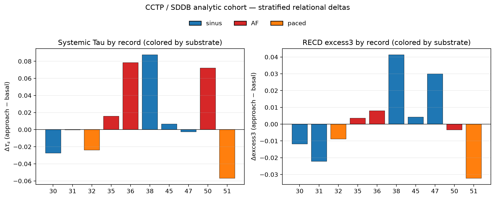
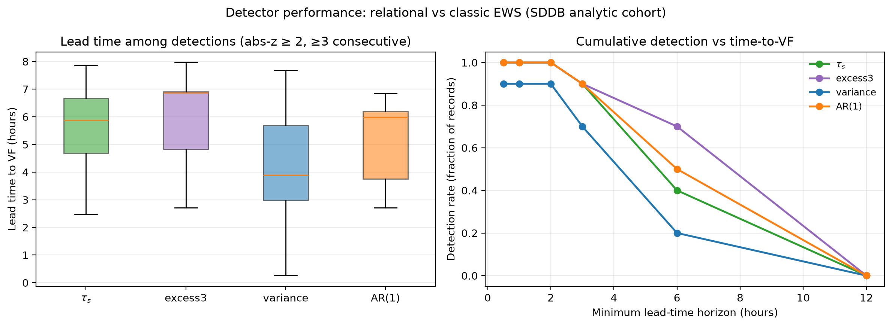
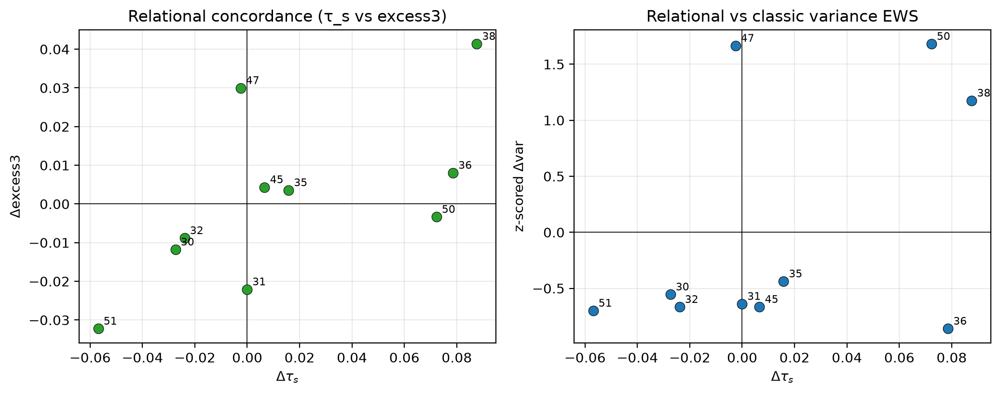

# Abstract

Sudden cardiac death from ventricular fibrillation (VF) remains difficult to anticipate from surface electrocardiography. Classic early-warning signals (EWS) such as rising variance or lag-1 autocorrelation often fail or reverse in real cardiac data because they assume a simple critical-slowing-down scenario. We introduce a relational, multivariate analysis pipeline that combines (i) \textbf{Systemic Tau} ($\tau_s$), an ordinal, Kendall-based measure of cross-variable coupling change, with (ii) \textbf{ordinal recurrence quantification} under the Discrete Extramental Clock (RECD) framework, which decomposes a bivariate heart-rate proxy into hierarchical symbolic levels ($\Phi_1$, $\Phi_2$, $\Phi_3$) and tracks the continuous excess contribution of the highest level (excess3).

Applied to $N=10$ high-quality records from the PhysioNet Sudden Cardiac Death Holter Database (SDDB; 23 records total), we find that $\Delta\tau_s$ and $\Delta\mathrm{excess3}$ are statistically extreme under phase-shuffle surrogates in the majority of cases and, crucially, maintain \textbf{sign concordance} (8/10 records) even when the direction is opposite to classical variance increase. After corrected VF anchoring, the cohort comprises six intermediate and four terminal events across sinus ($n=5$), atrial fibrillation ($n=3$), and intermittent pacing ($n=2$) substrates; stratified means show polarity that depends on substrate (e.g., negative relational deltas under pacing, positive mean $\Delta\tau_s$ under AF). A frozen abs-$z$ detector versus the basal window yields multi-hour median lead times (excess3 $\approx 6.9$\,h; $\tau_s\approx 5.9$\,h; variance $\approx 3.9$\,h) with discovery sensitivity 1.0 on event Holters only---false-alarm rate is undefined without control recordings. Intermittent pacing and atrial fibrillation cases were retained after explicit quality flagging and did not abolish the signal. Two records with small effect sizes (47 and 50) showed discordant direction and are interpreted as borderline transitions. Light re-calibration of synthetic-derived thresholds ($\theta_3=0.08$, high-threshold $=0.65$, relative $\lambda$) is documented; the continuous excess3 metric remains primary.

These results support a view of pre-VF transitions as \emph{context-dependent reorganizations of the relational structure of heart-rate dynamics}, rather than as a uniform loss of stability. The findings provide real-world physiological support for the Systemic Tau and RECD framework as tools capable of detecting relational reorganizations that precede critical transitions in noisy biological signals where classical univariate EWS fail or reverse. The pipeline is fully reproducible (\url{https://github.com/johelpadilla/cctp-sddb-systemic-tau}) and immediately extensible to other Holter collections.

An external pilot (Phase 1) applying the identical frozen pipeline to 11 independent short pre-VF/VT episodes from the PhysioNet VFDB database yielded sensitivity of 1.0 for $\tau_s$ and 0.82 for excess3, with sign concordance of 0.64 between the two relational metrics. Median lead times were short (~7–10 min) owing to the brief pre-event windows available in public short-recording databases. On negative-control Holters (NSRDB; Phase 1 $n=6$, then full-set interim Phase 2 $n=18$), the frozen abs-$z$ detector produced stably high false-alarm rates ($\tau_s\approx 33.7$ and excess3 $\approx 32.3$ alarms per 24 h on the full set). Expanding healthy-Holter sample size did not materially lower FAR, and NSRDB is not device-matched to VFDB telemetry; specificity---not sensitivity---remains the principal next scientific bottleneck. No clinical or deployability claims are made.

\vspace{0.4em}
\noindent\textbf{Keywords:} Systemic Tau; Discrete Extramental Clock (RECD); ordinal patterns; early-warning signals; ventricular fibrillation; heart-rate variability; network physiology; PhysioNet SDDB; critical transitions; surrogate testing.

\vspace{0.5em}
\noindent\rule{\textwidth}{0.4pt}

# 1. Introduction

## 1.1 Clinical and scientific motivation

Sudden cardiac death (SCD) is a leading cause of mortality worldwide, and ventricular fibrillation (VF) is among its principal terminal rhythms. Despite decades of progress in implantable devices, risk stratification, and Holter analysis, anticipating spontaneous VF from continuous surface ECG remains an open problem in both clinical cardiology and complex-systems physiology [@Goldberger2000; @Ivanov1999; @Bashan2012].

Classical approaches emphasize univariate heart-rate variability (HRV) descriptors---variance, lag-1 autocorrelation, fractal scaling, multifractality---and, more recently, machine-learning classifiers trained on pre-VF segments from public databases such as the Sudden Cardiac Death Holter Database (SDDB) [@Greenwald1986; @PhysioNetSDDB; @Velazquez2021; @Heng2020]. These tools are valuable, yet they often inherit an implicit dynamical assumption: that the approach to VF resembles a generic critical transition marked by critical slowing down (CSD), with rising variance and rising autocorrelation [@Scheffer2009; @Scheffer2012; @Dakos2012].

Empirical cardiac dynamics frequently violate that assumption. Variance may rise while lag-1 autocorrelation falls; atrial fibrillation (AF) and intermittent pacing can dominate the signal; annotation quality varies; and the same numerical "early warning" can point in opposite directions depending on the clinical substrate. What is needed is a language that tracks \emph{relational reorganization}---how the coupling among dynamical degrees of freedom changes---rather than only the amplitude of fluctuations in a single series.

## 1.2 Systemic Tau

Systemic Tau ($\tau_s$) is an ordinal, multivariate stability metric developed for noisy, non-stationary complex systems [@Padilla2025preprints; @Padilla2026synthesis; @Padilla2026software; @Padilla2025chaotic]. At its core it uses rank-based (Kendall-type) association structure across simultaneous series, computed in sliding windows, to quantify how \emph{relational coherence} evolves in time.

Let $X(t)=(X^{(1)}_t,\ldots,X^{(d)}_t)$ be a $d$-variate series (here $d=2$). In each sliding window of length $W_{\tau}$, Systemic Tau aggregates ordinal concordance among coordinates into a scalar $\tau_s(t)\in[-1,1]$ that rises when mutual rank organization tightens and falls when it loosens. The basal-to-approach contrast

$$
\Delta\tau_s=\overline{\tau_s}^{(\mathrm{approach})}-\overline{\tau_s}^{(\mathrm{basal})}
$$

is therefore a directed measure of relational reorganization, not a univariate fluctuation score. Three properties make $\tau_s$ attractive for Holter RR analysis:

1. **Ordinal robustness.** Because ranks replace raw amplitudes, $\tau_s$ is comparatively robust to monotone rescaling and to moderate outliers---a practical advantage on interpolated RR series.
2. **Multivariate by construction.** Systemic Tau is not a univariate complexity score; it measures change in \emph{cross-variable} organization. In this study the bivariate proxy is $X(t)=\big[z(\mathrm{RR}),\,z(|\Delta\mathrm{RR}|)\big]$, pairing level and successive irregularity.
3. **Early-warning orientation.** Large or systematic shifts in $\tau_s$ are interpreted as candidate signals of structural reorganization, not necessarily as ``approaching collapse'' in the classical CSD sense. The \emph{sign} of $\Delta\tau_s$ carries information about the \emph{direction} of the reorganization (e.g., tightening vs loosening of relational structure).

Readers familiar only with variance-based EWS may think of $\tau_s$ as answering a different question: not ``Is the system fluctuating more?'' but ``Is the \emph{pattern of mutual organization} among variables changing as the event approaches?''

## 1.3 Nested ordinal mathematics of the Discrete Extramental Clock (RECD)

The Discrete Extramental Clock (RECD) extends Systemic Tau by asking a complementary mathematical question: \emph{when} and \emph{at what depth} do multivariate ordinal events cohere strongly enough to advance a discrete, system-generated time index [@Padilla2026software; @Padilla2026ontological; @Padilla2026synthesis]. The framework builds hierarchical \textbf{ordinal conjunctions} from Bandt--Pompe symbolic dynamics [@BandtPompe2002]. On the same series $X(t)$, each coordinate is encoded by short ordinal patterns of embedding dimension $m$ and delay $\tau$ (here $m=3$, $\tau=1$). Write $\pi^{(i)}_t$ for the ordinal pattern of coordinate $i$ at time $t$. Conjunctions are not a single flat rule; they form a nested hierarchy---each deeper level contains and transcends the previous---with mathematics matched to the depth of structure:

**Level 1 --- coincidence ($\Phi_1$).** The weakest conjunction is simultaneous equality (or co-occurrence) of ordinal symbols across coordinates. With indicator $\mathbf{1}\{\cdot\}$,

$$
\Phi_1(t)=\sum_{i<j}\mathbf{1}\big\{\pi^{(i)}_t=\pi^{(j)}_t\big\}
$$

(or an equivalent windowed frequency of shared symbols). Level 1 is ordinal synchronization: pure counting statistics, mutual-information-like, and easy to validate, but insufficient alone to mark a nontrivial advance of discrete system time.

**Level 2 --- persistent relational structure ($\Phi_2$).** Level 2 does not require identical symbols; it requires a \emph{relation} $R$ among patterns that persists for at least $p_{\min}$ consecutive steps (lead/lag, opposition, fixed joint transition, meta-ordinal configuration). Schematically,

$$
\Phi_2(t)=\sum_{i<j} w(R)\,
\mathbf{1}\Big\{\,R\big(\pi^{(i)}_{t-k},\pi^{(j)}_{t-k}\big)
\text{ holds for all }k=0,\ldots,p_{\min}-1\,\Big\},
$$

where $w(R)$ weights relation type or strength. Graphically, Level 2 lives on a pattern graph or an ordinal Markov chain: nodes are patterns, edges encode durable cross-variable organization. The clock now advances not by volume of coincidences but by quality and memory of relational structure.

**Level 3 --- irreducible surplus / emergence ($\Phi_3$, excess3).** Level 3 isolates configurations whose joint ordinal organization is not explained by Levels 1--2 alone. Writing $I_{\mathrm{syn}}$ for a synergistic (or integrated) information surplus of the joint pattern set relative to pairwise relational structure,

$$
\Phi_3(t)=\mathbf{1}\big\{\,I_{\mathrm{syn}}\big(\{\pi^{(i)}_t\}_{i\in S}\big)>\theta_3\,\big\},
$$

with continuous companion

$$
\mathrm{excess3}(t)=
\big[I_{\mathrm{syn}}\big(\{\pi^{(i)}_t\}\big)
-I_{\mathrm{rel}}^{(2)}(t)\big]_+\,.
$$

Here $[\cdot]_+$ denotes the positive part and $I_{\mathrm{rel}}^{(2)}$ summarizes Level-2 relational information. Operationally, excess3 is the continuous surplus contribution of the highest nested layer beyond lower-order expectations---the practical Level-3 readout used throughout this study. A binary high-level rate (fraction of windows with excess3 above a threshold) is retained for extensibility but is secondary on noisy Holter data (Section 3.3).

**Nested advance of the RECD.** The three contributions combine as a depth-dependent update of the discrete clock,

$$
\Delta\mathrm{RECD}(t)
=\alpha_1\,\Phi_1(t)
+\alpha_2\,\Phi_2(t)
+\alpha_3\,\Phi_3(t),
$$

with nesting $\Phi_3\supset\Phi_2\supset\Phi_1$ in the sense that deeper activation presupposes, and is not reducible to, shallower coincidence/relation counts. Coefficients $\alpha_\ell$ need not be constant: near a control-parameter transition they can reweight toward deeper layers, so the RECD does not advance homogeneously---its mathematical regime changes with the depth of active conjunctions.

**Coupling to Systemic Tau (weighted RECD).** Systemic Tau supplies an empirical regime cue for that reweighting. Let $\lambda(t)$ be a monotone transform of $|\tau_s(t)|$ (absolute threshold near the synthetic chaotic scale $\sim 0.41$, or record-relative $|\tau_s|/\max|\tau_s|$). Weighted coefficients of the form

$$
\alpha_1(\lambda)\downarrow,\qquad
\alpha_2(\lambda)\uparrow,\qquad
\alpha_3(\lambda)\uparrow\!\uparrow
\quad\text{as }\lambda\text{ increases}
$$

encode the hypothesis that stronger relational volatility favors Level-2/3 mass over pure coincidence. When observed $|\tau_s|$ on Holter RR remains far below synthetic design scales, $\lambda$ is nearly constant and weighted contributions collapse toward the unweighted hierarchy; the continuous excess3 metric then carries the Level-3 signal (Sections 2.5 and 3.3).

In short: $\tau_s$ asks whether cross-variable organization is reorganizing; nested RECD asks \emph{at what ordinal depth} that reorganization is expressed. Pre-VF Holter analysis uses both jointly: $\Delta\tau_s$ for directed relational change, $\Delta\mathrm{excess3}$ for change in the irreducible Level-3 surplus.

## 1.4 Contribution of this work

This article provides the first systematic application of Systemic Tau and ordinal RECD to spontaneous human pre-VF Holter dynamics, with:

1. a quality-aware $N=10$ analysis of SDDB under realistic inclusion constraints;
2. explicit retention and flagging of intermittent pacing and AF;
3. surrogate-based tests of non-trivial relational structure;
4. documented light re-calibration of thresholds derived from synthetic series;
5. stratification by substrate and event geometry (intermediate vs terminal) after NPZ-anchored event times;
6. a frozen abs-$z$ lead-time detector and a head-to-head concordance matrix versus classical variance and lag-1 autocorrelation;
7. full reproducibility commands and accompanying figures.

The central empirical claim is: \textbf{pre-VF heart-rate dynamics exhibit context-dependent relational reorganization that is sign-concordant between $\tau_s$ and Level-3 excess3}, even when classical univariate EWS are weak, reversed, or clinically confounded. Lead-time analyses further show that the same relational series can depart from basal statistics hours before VF onset on discovery Holters, without yet establishing a false-alarm rate. This provides a physiological test of the nested RECD mathematics of Section 1.3 on spontaneous human Holter data.

# 2. Data and Methods

## 2.1 Database and inclusion

We used the PhysioNet Sudden Cardiac Death Holter Database (SDDB) [@PhysioNetSDDB; @Greenwald1986; @Goldberger2000]. SDDB comprises exactly 23 complete Holter recordings (records 30--52), typically $\sim$24\,h, sampled at 250\,Hz with two ECG leads. The cohort includes 18 subjects with underlying sinus rhythm (four with intermittent pacing), one continuously paced subject, and four with atrial fibrillation. VF onset markers (`#vfon`) appear in header comments for VF cases.

After strict filters---usable pre-event duration, clear event anchoring, low invalid-RR / interpolation fraction, and automated pacing flagging---the realistic high-quality ceiling on SDDB is approximately 8--12 records. Our final analytic set is $N=10$: records \textbf{30, 31, 32, 35, 36, 38, 45, 47, 50, 51}. Intermittent pacing in 32 and 51 was detected and retained.

## 2.2 RR extraction and quality metadata

Beat annotations were read with WFDB (`wfdb.rdann`), preferring audited `.atr` files and falling back to unaudited `.ari` when necessary. RR intervals (ms) were obtained as successive sample differences scaled by sampling frequency. Intervals outside $(250, 2000)$\,ms were treated as invalid and linearly interpolated. For each record we export: number of beats, interpolation fraction, coefficient of variation of RR, `pacing_detected`, and known pacing type (comment + known-record list + low-CV heuristic).

## 2.3 Bivariate proxy and Systemic Tau

Define the bivariate series

$$
X(t)=\big[z(\mathrm{RR}),\, z(|\Delta\mathrm{RR}|)\big],
$$

where $z(\cdot)$ denotes z-scoring within the analysis stream. Systemic Tau was computed with the published `systemictau` implementation [@Padilla2026software] using window $W_{\tau}=101$ beats and stride 5. Basal and approach regimes were defined as record-specific $\sim$3 h windows anchored to VF onset or end-of-recording (preserving legacy windows for records 30 and 35). The primary contrast is

$$
\Delta\tau_s = \overline{\tau_s}^{(\mathrm{approach})} - \overline{\tau_s}^{(\mathrm{basal})}.
$$

## 2.4 Surrogate testing

To test whether $\Delta\tau_s$ reflects genuine cross-dependence rather than marginal spectra, we generated phase-shuffle surrogates that approximately preserve individual power spectra while destroying cross-variable dependence [@Theiler1992]. For each record we used $n=8$ independent surrogates and report the directional surrogate $p$-value (fraction of surrogates with $|\Delta\tau_s^{\mathrm{surr}}|$ at least as extreme, with ties handled conservatively). Classical Welch tests on windowed samples are also reported for descriptive completeness.

## 2.5 Ordinal RECD levels and weighted RECD

The nested definitions of Section 1.3 were implemented on the same bivariate proxy $X(t)$ and the same basal/approach windows as $\tau_s$. Ordinal patterns used Bandt--Pompe encoding with $m=3$, delay $1$, window $w_{\phi}=101$, stride 5 [@BandtPompe2002]. Nested levels $\Phi_1$, $\Phi_2$, $\Phi_3$ and continuous excess3 were computed as the operational Level-1--3 hierarchy; primary empirical metrics remain mean excess3 and $\Delta\mathrm{excess3}$ (Level-3 continuous surplus). Weighted RECD implements $\alpha_\ell(\lambda)$ with $\lambda$ from $|\tau_s|$ as described in Section 1.3.

\textbf{Light re-calibration} (motivated by observed RR statistics; see Section 3.3):

- $\theta_3$: $0.10 \rightarrow 0.08$;
- high-threshold for binary high-level rate: $1.75 \rightarrow 0.65$;
- $\lambda$: record-relative scaling $|\tau_s|/\max|\tau_s|$ (or lowered absolute chaos threshold), because observed $|\tau_s|$ on Holter RR is much smaller than synthetic design values ($\sim 0.41$).

Weighted RECD completed on 6/10 records (30, 31, 32, 35, 38, 51); remaining records use unweighted excess3. A `has_weighted` flag is retained in the batch table.

## 2.6 Classical EWS for comparison

On the same RR series we computed rolling variance and lag-1 autocorrelation as standard CSD-style EWS [@Scheffer2009; @Dakos2012], reported as basal-to-approach deltas for qualitative comparison with relational metrics.

## 2.7 Stratification by substrate and event type

Each record was labeled by \textbf{substrate} (sinus / AF / paced) from rhythm metadata and automated pacing flags, and by \textbf{event type}: intermediate if the VF (or terminal arrhythmia) anchor leaves more than 3\,h of post-event recording ($(\mathrm{duration}-\mathrm{event\_hr})>3$\,h), otherwise terminal. Event hour was resolved from cleaned RR NPZ metadata (not from recording duration alone), correcting earlier terminal-heavy misclassification when `event_hr` was empty. Stratum-wise means and medians of $\Delta\tau_s$, $\Delta\mathrm{excess3}$, $\Delta\mathrm{var}$, and $\Delta\mathrm{AR}(1)$ are reported.

## 2.8 Lead-time detector (frozen rule)

For each metric series ($\tau_s$, excess3, rolling variance, lag-1 AR), we defined a discovery detector as the first time the absolute $z$-score relative to the basal-window mean and standard deviation exceeds $z=2$ for at least three consecutive windows (stride 5). Lead time is hours from that first sustained alarm to the event anchor. Sensitivity is the fraction of event Holters with any pre-event alarm; \textbf{false-alarm rate (FAR) is undefined} in the absence of independent control Holters and is reported as missing until external validation.

## 2.9 Head-to-head direction concordance

Pairwise \textbf{direction concordance} is the fraction of records in which $\mathrm{sign}(\Delta)$ agrees between two metrics (zeros treated as non-positive for sign). Concordance is computed for $\tau_s$ vs excess3, $\tau_s$ vs var, $\tau_s$ vs AR(1), excess3 vs var, and var vs AR(1), using identical basal/approach windows as Sections 2.3--2.6.

## 2.10 Software and reproducibility

Analyses used Python 3 with NumPy/SciPy/Pandas/Matplotlib, WFDB, and `systemictau` [@Padilla2026software]. Batch orchestration, quality reporting, nested RECD modules, stratification, lead-time detection, head-to-head comparison, and figure generation are provided in the public repository for this study [@Padilla2026CCTPcode] (`https://github.com/johelpadilla/cctp-sddb-systemic-tau`), including scripts `run_cctp_batch.py`, `run_cohort_stratified.py`, `run_leadtime_detector.py`, `run_ews_head2head.py`, `run_publication_figures.py`, `run_recd_on_rr.py`, `run_recd_weighted_on_rr.py`, and `analyze_cctp_pilot.py`. Exact reproduction commands appear in Appendix A.

# 3. Results

## 3.1 Cohort summary

Table 1 reports per-record $\Delta\tau_s$, surrogate $p$, $\Delta\mathrm{excess3}$, excess3 $p$-value, interpolation fraction, and pacing status for the $N=10$ analytic cohort.

\begin{table}[H]
\centering
\caption{Batch overview ($N=10$). $\Delta\tau_s$ and $\Delta\mathrm{excess3}$ are approach minus basal. Surrogate $p$ from phase-shuffle tests on $\Delta\tau_s$ ($n=8$). Interpolation fraction in percent. Pacing: automated flag.}
\label{tab:batch}
\small
\begin{tabular}{@{}rrrrrl@{}}
\toprule
Record & $\Delta\tau_s$ & $p_{\mathrm{surr}}$ & $\Delta\mathrm{excess3}$ & $p_{\mathrm{ex3}}$ & Pacing / note \\
\midrule
30 & $-0.0274$ & 0.00 & $-0.0118$ & $7.7\times10^{-78}$ & none \\
31 & $-0.0001$ & 0.25 & $-0.0221$ & $1.1\times10^{-222}$ & none \\
32 & $-0.0239$ & 0.00 & $-0.0088$ & $5.1\times10^{-108}$ & intermittent \\
35 & $+0.0158$ & 0.00 & $+0.0036$ & $3.2\times10^{-29}$ & none \\
36 & $+0.0786$ & 0.00 & $+0.0080$ & $1.0\times10^{-17}$ & AF \\
38 & $+0.0876$ & 0.00 & $+0.0414$ & $\approx 0$ & none \\
45 & $+0.0066$ & 0.25 & $+0.0043$ & $0.003$ & none \\
47 & $-0.0026$ & 0.25 & $+0.0300$ & $4.3\times10^{-68}$ & none \\
50 & $+0.0722$ & 0.00 & $-0.0033$ & $0.0009$ & AF \\
51 & $-0.0569$ & 0.00 & $-0.0322$ & $\approx 0$ & intermittent \\
\bottomrule
\end{tabular}
\end{table}

Two records with small effect sizes (47 and 50) showed discordant direction between $\Delta\tau_s$ and $\Delta\mathrm{excess3}$; these cases had among the smallest absolute relational deltas in the cohort and are interpreted as borderline transitions where reorganization is subtle.

\textbf{Sign concordance} between $\Delta\tau_s$ and $\Delta\mathrm{excess3}$ holds in \textbf{8/10} records. Six records achieve surrogate $p=0.00$ for $\Delta\tau_s$. Strongest absolute relational shifts include records 38 ($\Delta\tau_s=+0.0876$, $\Delta\mathrm{excess3}=+0.0414$), 36 ($+0.0786$, $+0.0080$), 51 ($-0.0569$, $-0.0322$), and 30 ($-0.0274$, $-0.0118$). Direction is context-dependent: positive for several AF/terminal patterns and negative for several paced/intermediate patterns.

{width=95%}

{width=95%}

{width=95%}

## 3.2 Case studies: strong positive and strong negative reorganization

Figure sets for individual records illustrate that relational metrics are not redundant with variance alone.

### Record 38 (strong positive $\Delta\tau_s$ and $\Delta\mathrm{excess3}$)

{width=95%}

{width=90%}

{width=75%}

{width=80%}

### Record 30 (negative relational shift with classical variance increase)

{width=95%}

{width=90%}

### Record 51 (intermittent pacing retained; strong negative concordance)

{width=95%}

{width=90%}

## 3.3 Light re-calibration and the status of high-level rate

Observed on the 10 RR series: median $|\Delta\tau_s|\approx 0.026$ (max $\approx 0.088$); basal excess3 typically $\approx 0.30$--$0.35$, with approach values up to $\approx 0.43$ on the strongest records.

The binary high-level3 rate remained zero at the recalibrated threshold ($0.65$) because observed excess3 values in these noisy RR series ranged between $\sim 0.30$ (basal) and $\sim 0.43$ (approach). Consequently, the continuous mean excess3 and its delta are used as the primary metrics; the rate metric is retained for future use on cleaner or longer recordings.

Deltas for mean excess3 are nearly unchanged under $\theta_3$ adjustment (raw excess3 is independent of $\theta_3$ at the reporting stage). When both weighted and unweighted RECD exist, deltas are numerically almost identical (e.g., record 38: unweighted $\Delta\approx 0.04151$, weighted $\Delta\approx 0.04136$), consistent with nearly constant $\lambda$ under small $|\tau_s|$.

## 3.4 Classical EWS versus relational metrics

Across the cohort:

- \textbf{Variance} almost always increases from basal to approach (classical CSD-compatible amplitude rise).
- \textbf{Lag-1 autocorrelation} frequently \emph{decreases}---opposite to naive CSD.
- $\tau_s$ and excess3 capture the \emph{direction of relational reorganization}, which can align with or oppose the variance story depending on record context (terminal vs intermediate event geometry; AF substrate; pacing).

This dissociation is not a failure of EWS theory; it is evidence that pre-VF Holter dynamics are not a single-parameter approach to a fold bifurcation. Relational metrics add a complementary axis of description [@Scheffer2009; @Ivanov2021].

## 3.5 Weighted RECD

Weighted RECD ($\alpha(\lambda)$ driven by $|\tau_s|$) completed on 6/10 records. Because empirical $|\tau_s|$ is far below synthetic activation scales, $\lambda(t)$ is nearly flat and frac-contrib3 remains high and relatively stable. The continuous excess3 delta---not the binary high-level rate---carries the differentiating signal. Full $\lambda$ activation is expected to matter more after further threshold work on cleaner multichannel recordings.

## 3.6 Stratified analysis by substrate and event type

With NPZ-anchored event hours, the $N=10$ cohort separates into \textbf{6 intermediate} events (records 30, 32, 38, 45, 47, 50) and \textbf{4 terminal} events (31, 35, 36, 51). Substrate counts are sinus $n=5$, AF $n=3$, paced $n=2$.

\begin{table}[H]
\centering
\caption{Stratum means of basal-to-approach deltas ($N=10$). Intermediate vs terminal uses a $>3$\,h post-event residual rule. Values rounded for display; full precision in repository CSV.}
\label{tab:stratified}
\small
\begin{tabular}{@{}lrrrrr@{}}
\toprule
Stratum & $n$ & mean $\Delta\tau_s$ & mean $\Delta\mathrm{excess3}$ & mean $\Delta\mathrm{var}$ & mean $\Delta\mathrm{AR}(1)$ \\
\midrule
AF & 3 & $+0.056$ & $+0.0028$ & $+1.1\times10^{4}$ & $+0.013$ \\
paced & 2 & $-0.040$ & $-0.021$ & $-446$ & $+0.036$ \\
sinus & 5 & $+0.013$ & $+0.008$ & $+1.2\times10^{4}$ & $-0.150$ \\
intermediate & 6 & $+0.019$ & $+0.009$ & $+1.6\times10^{4}$ & $-0.097$ \\
terminal & 4 & $+0.009$ & $-0.011$ & $-101$ & $-0.013$ \\
\bottomrule
\end{tabular}
\end{table}

Paced records show consistently \textbf{negative} relational deltas for both $\tau_s$ and excess3. AF records show a positive mean $\Delta\tau_s$. Sinus records are mixed (median $\Delta\tau_s\approx 0$). Intermediate events carry larger mean variance rises than terminal ones in this small sample. Terminal mean $\Delta\mathrm{excess3}$ is slightly negative ($n=4$) and should not be over-interpreted as a universal terminal signature. Figure~\ref{fig:strat} summarizes these patterns visually.

{#fig:strat width=95%}

## 3.7 Lead-time detector performance

Under the frozen abs-$z\geq 2$ rule sustained for three consecutive windows (Section 2.8), every metric alarms before the event on all 10 discovery Holters (sensitivity $=1.0$). Median lead times are \textbf{6.86\,h} (excess3), \textbf{5.88\,h} ($\tau_s$), \textbf{5.97\,h} (AR(1)), and \textbf{3.90\,h} (variance). At a 6\,h horizon, cumulative detection rates are 0.7 (excess3), 0.5 (AR(1)), 0.4 ($\tau_s$), and 0.2 (variance). The shortest $\tau_s$ lead occurs on borderline record 47 ($\approx 2.47$\,h).

\begin{table}[H]
\centering
\caption{Discovery lead-time detector ($N=10$ event Holters). FAR requires control Holters and is not estimable here.}
\label{tab:leadtime}
\small
\begin{tabular}{@{}lrrrr@{}}
\toprule
Metric & Sensitivity & Median lead (h) & Mean lead (h) & FAR \\
\midrule
excess3 & 1.0 & 6.86 & 5.91 & --- \\
$\tau_s$ & 1.0 & 5.88 & 5.63 & --- \\
AR(1) & 1.0 & 5.97 & 5.19 & --- \\
variance & 1.0 & 3.90 & 4.22 & --- \\
\bottomrule
\end{tabular}
\end{table}

These multi-hour leads are \textbf{hypothesis-generating}: they show that basal-relative departures in relational series can precede VF by hours on SDDB discovery records. They do \textbf{not} establish a clinical operating point, because FAR is undefined without non-event controls and because abs-$z$ alarms can respond to non-specific non-stationarity.

{width=95%}

## 3.8 Head-to-head concordance matrix

Direction concordance (fraction of records with agreeing $\mathrm{sign}(\Delta)$) is highest for the relational pair:

\begin{table}[H]
\centering
\caption{Pairwise direction concordance of basal-to-approach deltas ($N=10$).}
\label{tab:concordance}
\small
\begin{tabular}{@{}lc@{}}
\toprule
Metric pair & Concordance \\
\midrule
$\tau_s$ vs excess3 & \textbf{8/10 (0.8)} \\
$\tau_s$ vs AR(1) & 7/10 (0.7) \\
$\tau_s$ vs variance & 5/10 (0.5) \\
excess3 vs variance & 5/10 (0.5) \\
variance vs AR(1) & 2/10 (0.2) \\
\bottomrule
\end{tabular}
\end{table}

$\tau_s$ and excess3 remain the only high-concordance pair; variance and AR(1) agree on only 2/10 records, reinforcing that classical univariate EWS do not form a coherent CSD package on these Holters. Discordant relational records remain 47 and 50 (Section 3.1).

{width=85%}

## 3.9 External Validation Phase 1 Pilot (frozen pipeline)

To test whether the relational signal observed on the SDDB discovery cohort generalizes, the identical frozen parameters ($\theta_3=0.08$, high-threshold $=0.65$, $W_\tau=101$, stride $=5$, abs-$z \geq 2$ sustained for $\geq 3$ consecutive windows) were applied to independent public data without any re-tuning.

**Data footprint.** PhysioNet VFDB (22 records) and CUDB (35 records) were processed; after strict inclusion criteria (pre-event $\geq 15$ min, interpolation fraction $\leq 15\%$), 11 independent short episodes from VFDB remained processable (all in the `short_15_60min` stratum). CUDB contributed zero usable events. Six long healthy Holters from PhysioNet NSRDB served as negative controls for false-alarm rate (FAR) estimation. One additional SDDB record (44) was processed as an internal extension only.

**Sensitivity and lead-time (independent VFDB n=11).** Under the frozen detector: $\tau_s$ sensitivity 1.0 (median lead 0.173 h), excess3 sensitivity 0.82 (median lead 0.127 h). Sign concordance between $\Delta\tau_s$ and $\Delta$excess3 was 7/11 (0.64). All lead times are necessarily short because the source databases contain only brief pre-event segments.

**False-alarm rate (NSRDB controls).** On ~60 h of healthy control monitoring the frozen rule produced ~34.4 alarms per 24 h for $\tau_s$ and ~28.8 for excess3. Every control Holter generated at least one alarm episode. This quantifies the specificity limitation that was previously undefined.

**Interpretation.** Phase 1 demonstrates that the relational metrics continue to detect pre-event departures under frozen parameters on completely independent data. However, the high FAR on healthy controls shows that the current single-metric abs-$z$ rule is not yet specific enough for clinical use. No S1–S6 success criteria are claimed as fully met.

## 3.10 External Validation Phase 2 public interim (full NSRDB FAR)

Phase 2 asked whether the Phase 1 high FAR was an artifact of small control $n$. The same frozen abs-$z$ rule (no retune) was re-applied to the complete local NSRDB set of $n=18$ long healthy Holters (~180 h of capped search time: early basal ~2 h, search remainder capped at 12 h per record).

\begin{table}[H]
\centering
\caption{Public control FAR under the frozen primary rule (NSRDB). Phase 2 expands Phase 1 without parameter change.}
\label{tab:phase2_far}
\small
\begin{tabular}{@{}lcc@{}}
\toprule
Metric & Phase 1 ($n=6$) FAR / 24 h & Phase 2 full NSRDB ($n=18$) FAR / 24 h \\
\midrule
$\tau_s$ & $\approx 34.4$ & $\approx 33.7$ \\
excess3 & $\approx 28.8$ & $\approx 32.3$ \\
Fraction of controls with $\geq 1$ alarm & 1.0 & 1.0 \\
\bottomrule
\end{tabular}
\end{table}

**Honest reading.** Expanding from 6 to 18 healthy Holters does not materially lower primary FAR. The Phase 1 specificity bottleneck was therefore not a sampling fluke of $n=6$. Two caveats remain explicit: (i) \textbf{device mismatch}---NSRDB is rhythm-healthy ambulatory Holter ECG, not device-matched to VFDB/CU clinical telemetry; (ii) the frozen single-metric abs-$z$ rule still fails any clinical-style FAR tolerance (e.g., FAR $\leq 2$/24 h is not met and is not claimed). Public healthy Holter expansion is therefore closed as the main specificity path; the scientifically next step is quality-first institutional / device-matched non-event controls under the same frozen parameters, not further retuning on public data.

These interim numbers leave the discovery relational message intact: sign-concordant pre-VF reorganization on SDDB and Phase 1 external sensitivity still stand as evidence of what Systemic Tau and RECD can detect before VF. What they do not establish---and what this manuscript does not claim---is clinical specificity or deployability.

## 3.11 Toward native ordinal detectors (exploratory)

\noindent\textit{Placement.} This section follows the Phase~2 public FAR interim (Section~3.10) and precedes the Discussion, so that the frozen abs-$z$ specificity bottleneck is fully stated before any methodological alternative is introduced. It does not replace Sections~3.7--3.10 as the primary discovery or external-validation narrative. The present revision raises the rigor of the ordinal epilogue relative to earlier internal drafts: it keeps the exploratory trade-off surface, but places equal weight on \textbf{structural limitations of OPC} and on a \textbf{process self-critique} of how those limitations were discovered.

\noindent\textit{Accompanying visuals (suggested).} (i) Table~\ref{tab:ordinal_tradeoff} (sensitivity vs FAR for the three primary arms); (ii) optional scatter of all-event sensitivity against pooled NSRDB FAR (one point per detector); (iii) if space allows, a cascade head-to-head row next to the trade-off table. Formal definitions and full grids live in the repository technical notes cited at the end of the section.

### Ontological mismatch of the continuous abs-$z$ rule

Systemic Tau and RECD are built on ordinal structure: Bandt--Pompe ranks, discrete relation codes, and hierarchical symbolic levels ($\Phi_1$, $\Phi_2$, $\Phi_3$). That construction is deliberately robust to monotone re-scalings of the raw series. The production lead-time detector used throughout Sections~3.7--3.10, however, is a continuous absolute $z$-score on an already-aggregated scalar trajectory $m(t)$ (typically $\tau_s$ or excess3):

$$
z(t)=\frac{m(t)-\mu_{\mathrm{basal}}}{\sigma_{\mathrm{basal}}+\varepsilon},\qquad
A_{\mathrm{abs}\text{-}z}(t)=\mathbf{1}\{\lvert z(t)\rvert \ge 2\}
$$

with a sustained-run requirement of at least three consecutive alarmed windows. The rule is frozen for discovery and external reproducibility ($\theta_3=0.08$, high-threshold $0.65$, $W_\tau=101$, stride $=5$) and remains the \textbf{primary detector} of this manuscript. Ontologically, it reintroduces dependence on the first two moments of a continuous summary. That second-order continuous layer is not native to the discrete symbol stream that generates ordinal coupling: it can alarm when basal variance is small and $m(t)$ drifts modestly, and it can fail to register pure rank reorganizations that leave amplitude statistics nearly unchanged. The high FAR documented on NSRDB under this frozen rule (Sections~3.9--3.10) is therefore not only an empirical specificity problem; it is consistent with a predicate that measures excursion from basal mean and variance rather than reorganization of ordinal support.

### Motivation for native ordinal alternatives

The methodological question that follows is deliberately modest: can alarm predicates that remain entirely inside the discrete ordinal alphabet serve as \emph{exploratory alternatives}---not as production replacements, not as clinical upgrades, and not as a claim that the continuous rule is obsolete? Two independent detectors were formalized for that purpose:

\begin{enumerate}
\item \textbf{Ordinal Persistence Collapse (OPC):} alarm when the system collapses into a small repertoire of ordinal states and that collapse \emph{persists}.
\item \textbf{Symbolic Distribution Divergence (SDD):} alarm when the empirical distribution of ordinal symbols diverges from a fixed early basal law.
\end{enumerate}

Both consume only a joint Bandt--Pompe symbol stream (bivariate proxy, $m=3$, delay $=1$, joint alphabet $K=36$). Neither re-estimates $\mu$ or $\sigma$ of $m(t)$ or of the raw RR series. Options were kept strictly separate until a deliberately secondary fusion experiment (below). The design bias at this stage was explicit and, as argued later, partially self-limiting: prioritize ontological coherence with Level~2 of RECD (persistent relational locking) and reduction of control FAR relative to abs-$z$, under the hypothesis that a collapse+persistence predicate would be more selective than a continuous excursion rule. Formal definitions, edge cases, and reference implementations are recorded in `docs/ORDINAL_ALARM_DETECTORS.md`.

\subsection Ordinal Persistence Collapse (OPC)

Fix a window length $L$ of consecutive symbols ending at time $t$. Let $\mathrm{supp}(W_t)$ be the set of distinct symbols in that window and define the normalized support diversity

$$
D_t=\frac{\lvert\mathrm{supp}(W_t)\rvert}{K}\in\Bigl\{\tfrac{1}{K},\ldots,1\Bigr\}.
$$

A low-diversity indicator $\ell_t=\mathbf{1}\{D_t\le\theta_D\}$ yields a run length $R_t$ equal to the number of consecutive window endpoints ending at $t$ with $\ell=1$. The OPC alarm is the conjunction of collapse and persistence:

$$
A_{\mathrm{OPC}}(t)=\mathbf{1}\{D_t\le\theta_D\}\;\wedge\;\mathbf{1}\{R_t\ge\theta_R\}.
$$

Unless otherwise noted, the exploratory companion configuration is $L=50$, $\theta_D=0.35$, $\theta_R=5$, $K=36$ (chosen so that $\min(L,K)/K$ can exceed $\theta_D$ under a joint alphabet of size 36). Conceptually, OPC targets $\Phi_2$-adjacent locking: the system becomes trapped in few ordinal configurations for too long. It is expected---and empirically is---specificity-leaning: brief distributional wobbles that never collapse the support should not alarm. What that design \emph{does not} claim is that collapse of support is the only, or even the typical, pre-VF ordinal signature on Holter data.

### Symbolic Distribution Divergence (SDD)

Let $P_{\mathrm{basal}}$ be the empirical symbol distribution on a fixed early basal segment and $P_t$ the empirical distribution on a current window of length $L_c$. Total variation

$$
\mathrm{TV}(P_t,P_{\mathrm{basal}})=\tfrac{1}{2}\sum_{s\in\Sigma}\lvert P_t(s)-P_{\mathrm{basal}}(s)\rvert
$$

measures structural change of the ordinal law without reference to continuous amplitude. The exploratory SDD rule alarms when TV exceeds a threshold for a short sustained run:

$$
A_{\mathrm{SDD}}(t)=\mathbf{1}\{\mathrm{TV}(P_t,P_{\mathrm{basal}})\ge\theta_{\mathrm{TV}}\}
$$

with exploratory defaults $L_c=50$, $\theta_{\mathrm{TV}}=0.35$, sustained length $\theta_S=1$, fixed early basal, basal samples masked from the search. SDD is expected to be sensitivity-leaning: any sustained reorganization of symbol frequencies can fire, including reorganizations that keep moderate diversity. SDD is retained here as a contrast arm, not as a proposed production successor.

### Exploratory sensitivity--FAR trade-off

Sensitivity was scored as the fraction of pre-event records with at least one post-basal pre-event alarm on SDDB ($n=11$) plus independent VFDB events ($n=22$; 33 events total). FAR used the same Phase~2 control protocol as Section~3.10: NSRDB $n=18$ healthy Holters, early basal, search capped at 12 h per record (about 180 search-hours), refractory episode counting of 0.5 h, with $\mathrm{FAR}=(\mathrm{episodes}/\mathrm{search\ hours})\times 24$. Detectors were not retuned on these sets; abs-$z$ remained frozen. Full methodology and per-cohort tables appear in `docs/ORDINAL_SENSITIVITY_SPECIFICITY_TRADEOFF.md` and `docs/ORDINAL_NSRDB_FAR_COMPARISON.md`.

\begin{table}[H]
\centering
\caption{Exploratory sensitivity--FAR trade-off for three strictly separate detectors under fixed parameters. Sensitivity: SDDB+VFDB events ($n=33$). FAR: NSRDB controls ($n=18$, about 180 search-hours, refractory 0.5 h). No clinical claim; not a ranking of superiority.}
\label{tab:ordinal_tradeoff}
\small
\begin{tabular}{@{}lcccc@{}}
\toprule
Detector & Sens SDDB & Sens VFDB & Sens all & FAR / 24 h \\
\midrule
OPC ($L=50$) & 0.545 (6/11) & 0.364 (8/22) & 0.424 (14/33) & 3.733 \\
SDD (TV) & 1.000 (11/11) & 0.955 (21/22) & 0.970 (32/33) & 46.267 \\
abs-$z$ $\tau_s$ (frozen) & 1.000 (11/11) & 0.864 (19/22) & 0.909 (30/33) & 33.734 \\
\bottomrule
\end{tabular}
\end{table}

The three arms form a \textbf{trade-off surface}, not a winner. OPC is the most specific under these defaults (pooled FAR $\approx 3.73$/24 h; 28 control episodes; median per-record FAR $=0$) but detects only about 42\% of public pre-event records. SDD is the most sensitive (all-event sensitivity $\approx 0.97$) with the highest control FAR ($\approx 46.3$/24 h; 347 episodes; every control alarmed). Frozen abs-$z$ sits between them on FAR ($\approx 33.7$/24 h; high sensitivity $\approx 0.91$), reproducing the Phase~2 order of magnitude as a sanity anchor. Preference among arms therefore depends on the objective (specificity vs hit rate vs continuity with the frozen primary), not on a global superiority claim. NSRDB remains rhythm-healthy ambulatory Holter, not device-matched to VFDB/CU telemetry---the same caveat as Phase~2.

Importantly, OPC's specificity strength does \textbf{not} license reading it as a net advance over abs-$z$. On the same public event sets it misses roughly half of the events that abs-$z$ detects (all-event sensitivity $0.424$ vs $0.909$). That gap is the empirical entry point into the structural limitations below; it is not an accident of a single unlucky threshold.

### Light cascade SDD to OPC (secondary)

As a deliberately secondary experiment, an SDD candidate was confirmed only if OPC ($L=50$) also alarmed within a closed $\pm 5$ min window, with causal confirmation restricted to pre-event OPC (decision time $=\max(t_{\mathrm{SDD}},t_{\mathrm{OPC}})$ before the event). Cascade all-event sensitivity was 0.394 (13/33; SDDB 0.545, VFDB 0.318) with NSRDB FAR $\approx 3.87$/24 h (29 episodes)---essentially OPC-like specificity without recovering SDD's hit rate. Versus OPC alone the cascade gained 0 events and lost 1; versus SDD it gained 0 and lost 19. Because the cascade is SDD-first, it cannot detect events SDD misses, and OPC confirmation drops unconfirmed true SDD positives. Under these fixed parameters the cascade does not improve the joint balance relative to OPC alone; further cascade window-fishing is therefore low priority unless a new confirm rule is justified \emph{a priori}. Details: `docs/ORDINAL_CASCADE_FUSION.md`.

### Modest OPC parameter exploration

A 36-cell grid around the OPC companion---$L\in\{40,50,60,70\}$, $\theta_D\in\{0.30,0.35,0.40\}$, $\theta_R\in\{4,5,6\}$---was scored with the same sensitivity and FAR definitions, without retuning abs-$z$ and without fusion to SDD. No cell increased all-event sensitivity while keeping FAR within an exploratory slack of $\le\max(1.5\times\mathrm{baseline},\ \mathrm{baseline}+2)$. Sensitivity gains appeared only with substantially higher FAR (e.g., looser $\theta_D=0.40$ or shorter $L=40$). Qualitatively, larger $L$ averaged diversity over more symbols and damped brief collapses (lower sens, lower FAR); higher $\theta_D$ loosened the collapse threshold (higher sens, higher FAR); $\theta_R$ had a small marginal effect. The recommendation is therefore \textbf{keep baseline} ($L=50$, $\theta_D=0.35$, $\theta_R=5$). Full grid: `results/ordinal_opc_param_explore_report.md`.

The keep-baseline outcome is itself diagnostic: within a modest neighborhood of the companion configuration, OPC cannot buy back much sensitivity without surrendering the specificity that motivated its design. That pattern is consistent with structural limits of the \emph{predicate}, not only with a poorly chosen numerical cell.

### Structural limitations of OPC (four named weaknesses)

The low event sensitivity of OPC is not best explained as ``thresholds not yet optimized.'' A 36-cell grid already showed that sensitivity gains track FAR inflation; the residual misses are more coherently read as consequences of what the predicate is allowed to see. Four structural weaknesses are particularly important. The first and fourth are primarily \textbf{ontological} (what the rule cannot represent by construction); the second and third are \textbf{operational under realistic Holter dynamics}. All four were under-articulated during the conceptual design phase and became clear mainly after the exploratory bake-off forced a confrontation with missed events.

\paragraph{(1) Blindness to high-synergy reorganizations (Level~3 / excess3).}
OPC alarms only when support diversity collapses and that collapse persists. Level~3 structure in RECD---the irreducible surplus tracked by excess3---is not equivalent to a small support. A pre-event window can reorganize toward deeper joint ordinal conjunctions while still visiting many distinct joint symbols; the synergistic surplus can rise (or fall) without the system ``getting stuck'' in a low-diversity repertoire. Because OPC never consults Level~3 quantities, any pre-VF path that is primarily an excess3 reorganization is, by construction, outside its receptive field. This is not a tuning failure: no choice of $(L,\theta_D,\theta_R)$ invents a synergy statistic that the support-count predicate does not compute. The alignment originally claimed between OPC and ``a path toward $\Phi_3$'' was therefore aspirational rather than operational: collapse of diversity may \emph{sometimes} accompany deeper conjunction, but it is neither necessary nor sufficient for Level~3 change.

\paragraph{(2) Inherent difficulty on high-entropy substrates (e.g., atrial fibrillation).}
On high-entropy rhythm substrates such as AF, the joint ordinal alphabet is already richly occupied under basal conditions. Support diversity $D_t$ tends to remain elevated even when relational structure is reorganizing, because many symbols continue to appear at least once inside a window of length $L$. The collapse predicate then has little room to fire without either (a) demanding an unrealistically deep reduction of support that AF dynamics rarely sustain, or (b) loosening $\theta_D$ until specificity is compromised. Stratified sensitivity on public event sets already hints at this asymmetry (OPC all-event sensitivity is lower on VFDB than on SDDB under the same defaults), but the deeper point is structural: a detector whose positive class is ``few active symbols for long enough'' is mismatched to substrates whose generative process keeps many symbols active. Classical abs-$z$ on $\tau_s$ can still register directed coupling change on such substrates; OPC cannot substitute for that capability by counting support alone.

\paragraph{(3) Fragility to topological intermittency and persistence-counter reset.}
The persistence counter $R_t$ is a strict consecutive run on the low-diversity indicator $\ell_t$. Any single window that briefly returns above $\theta_D$ resets $R_t$ to zero. Pre-event Holter dynamics are often intermittent: ordinal support can collapse, reopen, and collapse again without producing a contiguous run of length $\theta_R$. From the standpoint of specificity, that reset is a feature---it prevents brief wobbles from accumulating into alarms. From the standpoint of sensitivity, it is a structural fragility: the biologically or dynamically relevant object may be a \emph{cluster} of near-collapse episodes rather than one uninterrupted low-diversity block. OPC, as defined, has no memory of interrupted collapses. The small empirical effect of $\theta_R$ in the 36-cell grid (marginal mean sensitivity nearly flat across $\theta_R\in\{4,5,6\}$) is consistent with a regime in which many candidate episodes never accumulate contiguous persistence at all, so modest changes in $\theta_R$ cannot recover them.

\paragraph{(4) Loss of directional relational information carried by Systemic Tau.}
Systemic Tau is not merely a diversity statistic. $\tau_s(t)\in[-1,1]$ encodes the \emph{direction} of ordinal concordance among coordinates---tightening versus loosening of mutual rank organization---and $\Delta\tau_s$ is the primary relational contrast of Sections~3.1--3.8. OPC operates on an unordered support set: it asks how many symbols are active, not whether those symbols express a directed change in cross-variable concordance. Two windows with identical support cardinality can correspond to opposite relational stories (one increasing mutual organization, one fragmenting it). By discarding direction, OPC sacrifices precisely the information that justified introducing Systemic Tau in the first place. This is the sharpest ontological trade-off of the design: one can stay inside a discrete alphabet and still preserve directed concordance (as $\tau_s$ itself does), but the collapse+persistence predicate does not. Treating OPC as a ``native'' successor to abs-$z$ on $\tau_s$ therefore overstates what was preserved; what was preserved is discreteness and support geometry, not the relational directional core.

These four limits jointly rationalize why OPC can be the most specific arm on NSRDB while remaining a weak event detector: it is selective for a narrow positive class (sustained support collapse) that is only partially overlapping with the pre-VF relational phenomena documented earlier in this manuscript.

### Process self-critique: reactive discovery of structural limits

An honest account must separate \emph{what the data showed} from \emph{when the design should have anticipated it}. Several of the weaknesses above are foreseeable from the formal definition of OPC alone, without any Holter experiment:

\begin{itemize}
\item Support cardinality is not Level~3 surplus (limit 1).
\item High basal entropy makes collapse rare by construction (limit 2).
\item A hard consecutive counter is discontinuous under intermittency (limit 3).
\item An unordered support statistic cannot encode the sign of $\Delta\tau_s$ (limit 4).
\end{itemize}

Yet during conceptual design the project prioritized (i) elegant alignment with $\Phi_2$-style persistence, (ii) freedom from continuous moments, and (iii) the hope of a lower FAR than abs-$z$. Stress-testing against high-synergy reorganization, AF-like high-entropy substrates, intermittent collapse, and sign-sensitive relational change was under-weighted. The sensitivity drop on public event data then functioned as a \textbf{reactive} revelation of limits that a more adversarial design review could have flagged \emph{a priori}. That sequencing is a methodological fault, not a rhetorical flourish: it means early internal narratives risked presenting OPC as ontologically ``more native'' than abs-$z$ without first listing what nativeness sacrifices. The present section corrects that imbalance. OPC remains a legitimate exploratory arm---especially as a specificity-leaning reference point---but it is not a conceptually complete ordinal replacement for the frozen primary, and it should not be marketed as one.

This self-critique does not invalidate the trade-off experiment. On the contrary, the bake-off was what made the costs measurable. The corrective step is epistemic: future ordinal detectors should be required, at the design stage, to state which RECD levels and which $\tau_s$ properties they intentionally discard, and to pre-specify failure modes on high-entropy and intermittent substrates before thresholds are celebrated for low FAR.

### Surplus-primary I0 and structural arms (Mode-S track; not promoted)

OPC is deliberately Level~3-blind. A complementary exploratory path therefore asked whether a \textbf{surplus-primary} ordinal alarm---persistence of synergistic surplus
$S_t=\mathrm{TV}(P_{\mathrm{joint}},P_1\otimes P_2)$ rather than collapse of support---could improve the sensitivity--FAR balance without making collapse the alarm engine (integrated OPSP / I0; \texttt{docs/INTEGRATED\_N2\_PERSIST\_N3\_SURPLUS\_DETECTOR.md}).

Under the same Holter protocol family (SDDB+VFDB sensitivity, $n=33$; NSRDB FAR, $n=18$), the default I0 cell ($\theta_{\Delta S}=0.08$, $\theta_R=5$, $L=50$) reached all-event sensitivity $\approx 0.79$ with FAR $\approx 40$/24\,h---high hit rate, but \textbf{not better} than frozen abs-$z$ on $\tau_s$ (sensitivity $\approx 0.91$, FAR $\approx 33.7$/24\,h). A pre-registered $4\times 4$ grid on $(\theta_{\Delta S},\theta_R)$ yielded \textbf{0/16 clear advances} versus OPC under the joint rule FAR $\le 2\times$ OPC and sensitivity $\ge 0.65$ (\texttt{docs/I0\_SURPLUS\_PARAM\_GRID.md}): the sens--FAR frontier is smooth; threshold retuning alone does not open the empty high-sens / low-FAR rectangle.

Six fixed \textbf{structural} arms then altered basal construction (percentile, MAD), persistence evidence (hop $\approx L/2$), and surplus window length ($L_S=100$), without another $\theta$-grid (\texttt{docs/I0\_STRUCTURAL\_ARMS.md}). Results: \textbf{0/6 structural wins} under the relaxed bar FAR $\le 2\times$ OPC and sensitivity $\ge 0.55$. Directionally, hop is a real FAR lever ($\sim$40 $\to$ $\sim$11/24\,h) but collapses short VFDB pre-events; MAD basal is the best single dual lever (sensitivity $\approx 0.61$, FAR $\approx 23$) yet still far from OPC's specificity band; absolute q90 basal alone can \emph{raise} FAR; larger $L_S$ does not unlock a new operating region. The stop rule therefore fires: surplus-primary I0 is closed as a FAR-competitive replacement for OPC or for abs-$z$. It remains an optional Level~3-proxy / Mode-S \textbf{narrative} arm only.

### Practical ranking for pre-VF / ventricular-arrhythmia event detection

The ordinal epilogue is easy to misread as a search for a ``better detector than abs-$z$.'' On public Holter evidence the ranking for \textbf{not missing pre-event records} that actually terminate in ventricular tachyarrhythmia / SCD-class endpoints is unambiguous, and it should be stated as part of the final report:

\begin{enumerate}
\item \textbf{Frozen continuous abs-$z$ on $\tau_s$} --- preferred \emph{primary alarm operating point} among arms evaluated here when the objective is event hit rate on SDDB+VFDB (all-event sensitivity $\approx 0.91$) while retaining directed relational information from Systemic Tau. FAR on NSRDB remains high ($\approx 33.7$/24\,h); that is a known Phase~2 limitation, not a reason to demote abs-$z$ in favor of lower-sensitivity ordinals.
\item \textbf{SDD} --- maximum exploratory hit rate ($\approx 0.97$) with the worst control FAR ($\approx 46$/24\,h). Useful as a sensitivity ceiling reference, not as a practical primary.
\item \textbf{I0 / OPS surplus-primary} --- Mode-S narrative / Level~3-consistent proxy; default sensitivity $\approx 0.76$--$0.79$ with FAR $\gtrsim$ abs-$z$. Parameter grids and structural arms do \textbf{not} promote it over abs-$z$ for event detection.
\item \textbf{OPC ($L=50$)} --- best \emph{specificity-leaning ordinal companion} (FAR $\approx 3.73$/24\,h) but only $\approx 42\%$ all-event sensitivity. Appropriate as a low-FAR reference row, \textbf{not} as the preferred detector for patients or records that truly evolve toward ventricular events in this corpus.
\item \textbf{Collapse-filtered surplus (I-confirm)} --- very low FAR at the cost of Level~3 visibility (sensitivity $\approx 0.27$); secondary only.
\end{enumerate}

In plain terms: if the scientific or translational question is ``which rule, among those we measured, is least wrong for Holters that \emph{do} harbor pre-ventricular-event dynamics?,'' the answer is the \textbf{parametric abs-$z$ rule on continuous $\tau_s$}, not OPC and not I0. OPC answers a different question (how low can ordinal FAR go under a collapse+persistence predicate). I0 answers whether sustained synergistic surplus can alarm without collapse---interesting ontologically, not competitive as a primary on this public bake-off. None of these rankings is a clinical endorsement, FDA claim, or deployability statement; event $n$ is small and controls are device-mismatched healthy Holters.

\subsection Honest reading: achievements, non-claims, and manuscript stance

\textbf{What this section supports.} Native ordinal detectors can be defined rigorously on the same symbol substrate that underlies Systemic Tau / RECD, evaluated side-by-side with the frozen abs-$z$ rule, and summarized as a transparent trade-off surface on public PhysioNet cohorts. OPC illustrates a specificity-leaning collapse+persistence operating point with real control-FAR reduction under fixed parameters; SDD illustrates a sensitivity-leaning distributional operating point; abs-$z$ remains the frozen continuous baseline and, after the full ordinal + surplus program, the preferred primary operating point for pre-VF \emph{event hit rate}. Mapping predicate $\mapsto$ operating region is scientifically useful: it shows that the high FAR of Sections~3.9--3.10 is not an inevitable property of ``any detector on $\tau_s$,'' but is tied to a particular continuous decision rule. Equally, the same mapping shows that OPC's FAR gain is purchased by ontological restrictions that leave many pre-VF reorganizations invisible, and that surplus-primary I0 does not close that gap while remaining FAR-competitive.

\textbf{What this section does not support.} No claim that OPC, SDD, cascade, or I0/OPS is overall superior to abs-$z$. No clinical utility, FDA readiness, deployability, or S5-style FAR $\le 2$/24 h for any arm. Event $n$ is small (11+22); NSRDB is not device-matched institutional telemetry; FAR is an episode rate under a refractory protocol, not classical $1-\mathrm{specificity}$; timebases differ (strided continuous $\tau_s$ vs symbol-endpoint ordinal streams) even though the FAR definition is shared. Cascade, $\theta$-grids, and structural surplus arms were exploratory secondary analyses, not nested cross-validated optimization. Production abs-$z$ thresholds remain frozen. Surplus-primary I0 is \textbf{not promoted}.

\textbf{Practical implication for the manuscript.} The primary scientific story remains context-dependent relational reorganization before VF (Sections~3.1--3.8) plus honest external FAR under the frozen continuous rule (Sections~3.9--3.10). Section~3.11 is a methodological epilogue with a \textbf{triple} message: (i) scale-aligned ordinal alarm design is possible and yields a readable sensitivity--specificity surface; (ii) the most FAR-attractive ordinal arm (OPC) is structurally incomplete relative to Systemic Tau / Level~3; (iii) after surplus-primary grids and structural arms, the ranking for not missing public pre-ventricular events still favors \textbf{abs-$z$ on $\tau_s$} as primary, OPC as specificity companion, and I0 as non-promoted Mode-S narrative only. Deeper formalization and full numerical tables live outside the main text in:

\begin{itemize}
\item \texttt{docs/ORDINAL\_ALARM\_DETECTORS.md} --- formal OPC/SDD definitions;
\item \texttt{docs/ORDINAL\_SENSITIVITY\_SPECIFICITY\_TRADEOFF.md} --- joint sens$\times$FAR trade-off;
\item \texttt{docs/ORDINAL\_NSRDB\_FAR\_COMPARISON.md} --- control FAR methodology;
\item \texttt{docs/ORDINAL\_CASCADE\_FUSION.md} --- causal cascade SDD$\to$OPC;
\item \texttt{results/ordinal\_opc\_param\_explore\_report.md} --- 36-cell OPC grid and keep-baseline decision;
\item \texttt{docs/I0\_SURPLUS\_PARAM\_GRID.md} --- pre-registered I0 $\theta$-grid (0/16 clear advances);
\item \texttt{docs/I0\_STRUCTURAL\_ARMS.md} --- structural surplus arms R0--R5 (0/6; stop surplus-primary).
\end{itemize}

# 4. Discussion

## 4.1 Context-dependent reorganization as the central message

The strongest interpretive claim supported by these data is not "a universal numeric threshold predicts VF," but rather: \textbf{the relational organization of heart-rate dynamics reconfigures before spontaneous VF, and the sign of that reconfiguration is itself informative}. Positive $\Delta\tau_s$/$\Delta\mathrm{excess3}$ and negative $\Delta\tau_s$/$\Delta\mathrm{excess3}$ both appear, each with surrogate support in strong cases. Stratified means (Section 3.6) place that dependence on substrate: paced Holters trend negative relationally; AF trends positive in $\Delta\tau_s$; sinus is mixed. This context dependence is a feature of physiological diversity, not noise to be averaged away.

A useful distinction is that between measuring the amplitude of fluctuations (variance) and measuring whether coupled variables reorganize their mutual pattern (relational structure). Both can change before a transition; only the second tracks reorganization of interaction. The head-to-head matrix (Section 3.8) quantifies that distinction: relational concordance 0.8 versus variance--AR(1) concordance 0.2.

Lead-time results (Section 3.7) add a temporal claim---relational series can depart from basal statistics many hours before VF on discovery records---while remaining strictly limited by missing FAR.

The external pilot (Phase 1) on 11 independent VFDB episodes provides the first evidence that the relational reorganization signature detected by $\tau_s$ and excess3 on SDDB generalizes beyond the discovery corpus under strictly frozen parameters. Sensitivity remained high, yet the same rule produced unacceptably high false-alarm rates on healthy control Holters. Phase 2's full-NSRDB interim ($n=18$; Section 3.10) shows that expanding public healthy Holters leaves FAR essentially unchanged ($\tau_s\approx 33.7$/24 h; excess3 $\approx 32.3$/24 h) under device mismatch. Together, the two external stages reframe the research priority without diluting the discovery claim: the relational pre-VF signal is real enough to transfer under frozen parameters; the single-metric abs-$z$ operating point is not yet specific. Future work must prioritize quality-first device-matched non-event controls and, if pre-registered, better basal referencing or multi-metric fusion---not further sensitivity hunting on short public databases, and not silent retuning of discovery thresholds on validation data.

Section~3.11 sharpens a second clause that is easy to confuse with the first. High FAR under abs-$z$ motivated ordinal alternatives, but those alternatives do \textbf{not} replace abs-$z$ as the preferred primary for detecting Holters that truly evolve toward ventricular endpoints in this public corpus. OPC buys specificity by becoming blind to Level~3 and to the sign of $\Delta\tau_s$; surplus-primary I0 keeps a Level~3-proxy path but never jointly beats OPC on FAR and abs-$z$ on sensitivity after pre-registered grids and structural arms. For the question ``which measured rule is least wrong when the record \emph{does} harbor pre-ventricular-event dynamics?,'' the final report therefore ranks \textbf{abs-$z$ on $\tau_s$ first}, SDD as a high-FAR sensitivity ceiling, I0 as non-promoted Mode-S narrative, and OPC as the low-FAR ordinal companion---explicitly not as the preferred event detector. That ranking is methodological, not clinical.

## 4.2 Relation to classical EWS and network physiology

Critical-slowing-down indicators remain theoretically important for systems near certain bifurcations [@Scheffer2009; @Dakos2012]. Cardiac RR series under Holter conditions, however, combine non-stationarity, ectopy, AF, pacing, and autonomic modulation [@Ivanov1999; @Bashan2012; @Bartsch2015]. Network Physiology emphasizes that organism-level states emerge from coordinated organ-system interactions [@Bashan2012; @Ivanov2021]. Our bivariate RR--$|\Delta\mathrm{RR}|$ proxy is a deliberately minimal relational embedding of that idea at the heart-rate scale: level and successive irregularity as coupled observables.

Prior SDDB studies have focused on classification accuracy for SCD/VF prediction using features and machine learning [@Velazquez2021; @Heng2020]. The present work is complementary: it asks a dynamical-systems question about pre-event reorganization and reports transparent effect directions, surrogates, and quality flags rather than a single black-box score.

## 4.3 Systemic Tau / RECD in the broader research program

Systemic Tau and RECD were developed as general tools for ordinal early-warning analysis in complex systems, with theoretical synthesis and software releases documented in the author's prior work [@Padilla2025preprints; @Padilla2026synthesis; @Padilla2026software; @Padilla2025chaotic]. Applications to public-health surveillance (e.g., dengue early warning) and to chaotic modular systems motivate the same design choices used here: ordinal robustness, multivariate coupling, and hierarchical symbolic accumulation. The Holter results supply a physiological test case in which classical variance-based signals are often incomplete.

## 4.4 Pacing, AF, and borderline cases

Intermittent pacing and AF were not excluded a priori. Automated flags and interpolation fractions accompany every claim. Record 32 (intermittent pacing, interpolation fraction $5.22\%$) was retained after automated quality flagging but exhibited noisier dynamics in the approach window; its inclusion did not reverse the overall sign-concordance pattern. Records 47 and 50 illustrate that small absolute deltas can break concordance and should be treated as borderline rather than definitive.

# 5. Limitations

1. \textbf{Scale of SDDB.} The database contains only 23 records. After strict filters, $N\approx 8$--$12$ is the realistic high-quality ceiling; here $N=10$. This scale supports a first relational study but not multi-center clinical claim-making. Stratified cells (e.g., paced $n=2$, terminal $n=4$) are too small for formal interaction tests.
2. \textbf{Annotation heterogeneity.} Audited `.atr` annotations are preferred; unaudited `.ari` fallbacks are required for some records. Pacing detection is robust (comment + known list + CV heuristic) but paced RR interpretation remains cautious.
3. \textbf{Sparse clinical metadata.} Age, sex, medications, ejection fraction, and etiology are often missing or incomplete. Subgroup clinical interpretation is therefore limited.
4. \textbf{Single retrospective public corpus.} Recordings originate primarily from 1980s Boston-area hospitals. External validation on independent pre-VF Holter collections is mandatory before translation.
5. \textbf{Small absolute magnitudes.} Physiological $|\tau_s|$ and excess3 deltas are modest; synthetic-derived thresholds required light re-calibration. The binary high-level rate remains uninformative at $0.65$ on these series.
6. \textbf{Surrogate budget.} Phase-shuffle ensembles use $n=8$ per record (light but directional). Larger ensembles and alternative surrogate classes (IAAFT, twin surrogates) are natural extensions.
7. \textbf{Bivariate proxy.} The RR--$|\Delta\mathrm{RR}|$ embedding is intentional and minimal; richer multichannel ECG or multimodal Network Physiology embeddings may strengthen $\lambda$-weighted RECD.
8. \textbf{Discovery detector vs control FAR.} On SDDB event Holters alone, the abs-$z$ lead-time analysis reports discovery sensitivity only (FAR undefined until controls). External NSRDB controls now quantify FAR, but the rate remains high under the frozen rule ($\sim$33--34 alarms per 24 h for $\tau_s$; Section 3.10). Sensitivity of 1.0 on event-only discovery records is expected to be optimistic relative to any future clinical operating point. Positive predictive value and deployability are not claimed.
9. \textbf{External pilot limitations.} Phase 1 used short public VFDB episodes; longer pre-event windows and device-matched controls are required for clinically meaningful lead-time and FAR comparisons. Phase 2 confirms high FAR on the full NSRDB set ($n=18$), but NSRDB remains rhythm-healthy Holter---not device-matched to VFDB telemetry---so public interim FAR is an upper-bound / mismatch-caveated reference only. Institutional device-matched non-event series are not yet included.

# 6. Conclusions

Systemic Tau combined with ordinal RECD provides a reproducible, sign-concordant early-warning signature of spontaneous VF that is invisible or reversed by classical univariate EWS in several records. The relational metrics detect reorganization even when variance-based signals are weak or reversed; intermittent pacing and AF, when explicitly flagged, do not abolish the pattern. After corrected event anchoring, substrate- and geometry-stratified deltas, multi-hour discovery lead times (median excess3 $\approx 6.9$\,h; $\tau_s\approx 5.9$\,h versus variance $\approx 3.9$\,h), and a head-to-head concordance matrix (0.8 for $\tau_s$--excess3 versus 0.2 for variance--AR(1)) strengthen the case that pre-VF Holter dynamics are relational reorganizations rather than a single critical-slowing trajectory.

External validation under strictly frozen parameters adds two honest layers: Phase 1 shows high sensitivity on independent short VFDB episodes, and Phase 2 shows that full public NSRDB controls ($n=18$) leave primary FAR high ($\tau_s\approx 33.7$/24 h; excess3 $\approx 32.3$/24 h) under device mismatch. The manuscript therefore closes the public interim as a transparent specificity reference---not as clinical readiness. No clinical, FDA, or deployability claim is made.

Exploratory native ordinal detectors (Section~3.11) map a sensitivity--FAR trade-off surface on the same public protocol family. Among those arms, \textbf{OPC} is the strongest specificity-leaning companion (FAR $\approx 3.73$/24\,h) but misses most pre-event records (sensitivity $\approx 0.42$). \textbf{SDD} maximizes hit rate at catastrophic control FAR. \textbf{Surplus-primary I0} and its structural variants do not promote over abs-$z$: grids and structural arms close the surplus track as a FAR-competitive primary. For Holters that actually harbor pre-ventricular-event dynamics in this corpus, the preferred primary operating point among rules evaluated here remains the \textbf{parametric abs-$z$ detector on continuous Systemic Tau $\tau_s$} (sensitivity $\approx 0.91$), accepting that its public control FAR is still too high for deployment claims. In short: abs-$z$ for event coverage and directed relational continuity; OPC for a low-FAR ordinal reference; I0 only as non-promoted Level~3-proxy narrative.

These findings provide real-world physiological support for the Systemic Tau and RECD framework as tools capable of detecting context-dependent relational reorganizations that precede critical transitions, even in noisy biological signals where classical univariate early-warning signals fail or reverse. They are an honest example of what the relational metrics can surface before VF---and of what they do not yet resolve on public healthy Holters.

Natural extensions include (i) quality-first institutional / device-matched non-event controls under the same frozen rule, (ii) richer multivariate proxies under the Network Physiology program, and (iii) only if pre-registered, exploratory multi-metric fusion or basal redesign labeled as secondary to the frozen primary detector---not further unregistered I0 threshold or hop micro-variants on the same public Holters.

# Data and Code Availability

- \textbf{SDDB:} PhysioNet Sudden Cardiac Death Holter Database, DOI \href{https://doi.org/10.13026/C2W306}{10.13026/C2W306} [@PhysioNetSDDB; @Greenwald1986; @Goldberger2000].
- \textbf{Analysis code for this study (primary):} full pipeline (RR extraction, Systemic Tau, phase-shuffle surrogates, nested ordinal RECD / excess3, weighted RECD, batch orchestration), cleaned RR series for the $N=10$ cohort, results tables, and figures are publicly available at \url{https://github.com/johelpadilla/cctp-sddb-systemic-tau} and archived on Zenodo (DOI \href{https://doi.org/10.5281/zenodo.21270699}{10.5281/zenodo.21270699}; concept DOI \href{https://doi.org/10.5281/zenodo.21270698}{10.5281/zenodo.21270698}) [@Padilla2026CCTPcode].
- \textbf{Systemic Tau core library:} `systemictau` Python package [@Padilla2026software], \url{https://github.com/johelpadilla/systemictau}.
- \textbf{Theory:} prior Systemic Tau / RECD works and syntheses [@Padilla2025preprints; @Padilla2026synthesis; @Padilla2025chaotic].

# Acknowledgments

The author thanks the PhysioNet / MIT Laboratory for Computational Physiology community for maintaining public critical-care and Holter resources that make independent reanalysis possible.

# Author Contributions

J.P.-V. conceived the study, developed the Systemic Tau / RECD framework, implemented the analysis pipeline, performed the SDDB experiments, prepared figures, and wrote the manuscript.

# Competing Interests

The author declares no competing financial interests. The `systemictau` software is released under an MIT license; related theoretical works are under CC-BY where indicated by their respective repositories.

# Ethical Statement

This study analyzes exclusively de-identified, publicly available Holter recordings from PhysioNet SDDB. No new human-subjects enrollment was performed.

# References

::: {#refs}
:::

# Appendix A. Reproducibility commands

Public repository: \url{https://github.com/johelpadilla/cctp-sddb-systemic-tau}  
Zenodo archive (v1.0.1): DOI \href{https://doi.org/10.5281/zenodo.21270699}{10.5281/zenodo.21270699}

```bash
git clone https://github.com/johelpadilla/cctp-sddb-systemic-tau.git
cd cctp-sddb-systemic-tau
python3 -m venv .venv && source .venv/bin/activate
pip install -r requirements.txt

# Full batch with final paper parameters (N=10)
python3 code/run_cctp_batch.py \
  --records 30,31,32,35,36,38,45,47,50,51 \
  --theta3 0.08 --high-thresh 0.65 --lambda-relative --force

# Single-record RECD (example: strongest positive case)
python3 code/run_recd_on_rr.py --record 38 --theta3 0.08 --high-thresh 0.65
python3 code/run_recd_weighted_on_rr.py --record 38 \
  --theta3 0.08 --high-thresh 0.65 --lambda-relative

# Inspect consolidated table
python3 -c "
import pandas as pd
df = pd.read_csv('results/cctp_batch_summary.csv')
cols = ['record','delta_tau','p_tau_surrogate','delta_excess3',
        'p_excess3','interp_frac','pacing_detected','has_weighted']
print(df[cols].to_string(index=False))
"

# Stratified cohort, lead-time detector, head-to-head EWS (frozen params)
python3 code/run_cohort_stratified.py
python3 code/run_leadtime_detector.py
python3 code/run_ews_head2head.py
python3 code/run_publication_figures.py

# Unit tests for lead-time / event-type helpers
python3 tests/test_leadtime_detector.py

# External Validation Phase 1 (frozen params, independent VFDB + controls)
python3 code/extract_rr_external.py --db all
python3 code/run_external_validation_phase1.py
# (optional internal extension)
python3 code/run_external_validation_phase1.py --include-sddb-extension

# External Validation Phase 2 public interim FAR (full NSRDB; frozen rule)
python3 code/download_nsrdb_records.py --remaining   # if re-fetching annotations
python3 code/extract_rr_external.py --db nsrdb
python3 code/run_external_validation_phase2_far.py
```

# Appendix B. Notation

| Symbol | Meaning |
|--------|---------|
| $\tau_s$ | Systemic Tau (windowed ordinal/relational coupling metric) |
| $\Delta\tau_s$ | Approach minus basal mean $\tau_s$ |
| $\pi^{(i)}_t$ | Bandt--Pompe ordinal pattern of coordinate $i$ at time $t$ |
| $\Phi_1$ | Level 1: coincidence / shared ordinal symbols |
| $\Phi_2$ | Level 2: persistent cross-variable ordinal relation |
| $\Phi_3$ | Level 3: irreducible / emergent conjunction indicator |
| excess3 | Continuous Level-3 surplus beyond lower-order structure |
| $\Delta\mathrm{RECD}$ | Nested clock update $\alpha_1\Phi_1+\alpha_2\Phi_2+\alpha_3\Phi_3$ |
| $\alpha_\ell(\lambda)$ | Depth weights; may depend on regime cue $\lambda$ |
| $\theta_3$ | Threshold for Level-3 logic (re-calibrated to 0.08) |
| $\lambda$ | Weighting factor from $|\tau_s|$ (relative scaling used) |
| $W_{\tau}, w_{\phi}$ | Sliding windows for $\tau_s$ and ordinal RECD (101 beats) |
| $m$ | Bandt--Pompe embedding dimension (3) |
| $p_{\min}$ | Minimum persistence length for Level-2 relations |

# Supplementary Information

The following materials accompany the main text:

**S1. Batch figures.** Comparative plots of $\Delta\tau_s$ and $\Delta\mathrm{excess3}$, significance overview, and quality/pacing summary across the $N=10$ cohort.

**S2. Per-record diagnostic panels.** For key records 30, 35, 38, 50, and 51: multi-panel early-warning traces, excess3 time series and boxplots, surrogate histograms for $\Delta\tau_s$, and, where available, weighted RECD contributions.

**S3. Sensitivity to re-calibration.** Changing $\theta_3$ from 0.10 to 0.08 and the high-threshold from 1.75 to 0.65 does not reverse sign concordance; continuous $\Delta\mathrm{excess3}$ remains the primary readout. Relative $\lambda$ is recommended when $|\tau_s|\ll$ the synthetic design scale.

**S4. Quality inventory.** Per-record $n_{\mathrm{beats}}$, interpolation fraction, $\mathrm{CV}_{\mathrm{RR}}$, pacing flags, and weighted-RECD availability.

**S5. Borderline records 47 and 50.** Small absolute $\Delta\tau_s$ with non-concordant $\Delta\mathrm{excess3}$ are interpreted as indeterminate or borderline transitions rather than as definitive alerts.

**S6. Stratification, lead-time, and head-to-head (Jul-12 2026 run).** Corrected intermediate/terminal labels (6/4), substrate strata, abs-$z$ lead-time tables (`leadtime_per_record.csv`, `leadtime_detector_summary.json`), concordance matrix (`ews_head2head_report.json`), and publication figures under `figures/publication/` (also mirrored in `manuscript/figures/publication/`). Interpretation note: `docs/JUL12_RESULTS_INTERPRETATION.md`.

**S7. Software and code archive.** Analyses used `systemictau`, WFDB, and standard scientific Python libraries (NumPy, SciPy, Pandas, Matplotlib). The complete study repository is at \url{https://github.com/johelpadilla/cctp-sddb-systemic-tau}.

**S8. External Validation Phase 2 public interim.** Full NSRDB FAR under the frozen primary rule (`results/external_phase2_far.json`, `results/external_phase2_summary.json`, inventory `results/phase2_public_control_inventory.csv`). Device-mismatch caveat and institutional Tier A request draft: `docs/EXTERNAL_VALIDATION_PHASE2_PROGRESS.md`, `docs/PHASE2_INSTITUTIONAL_DATA_REQUEST.md`.
